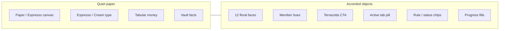
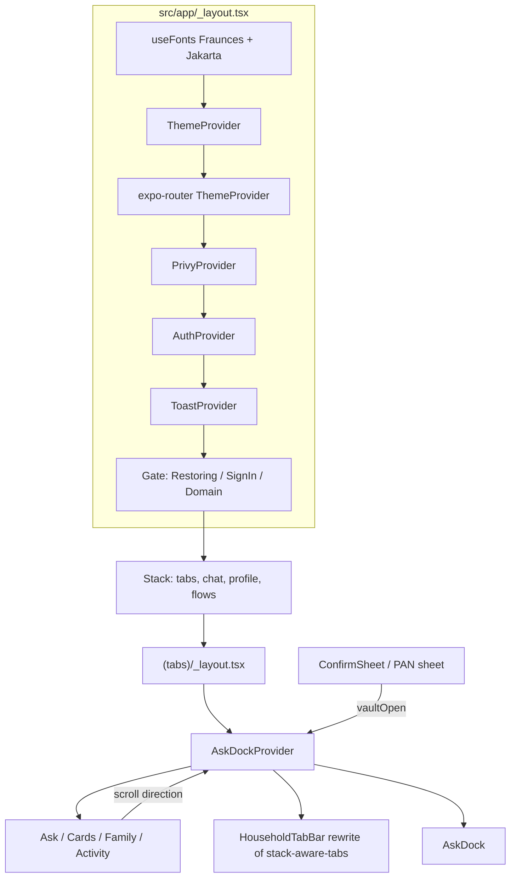
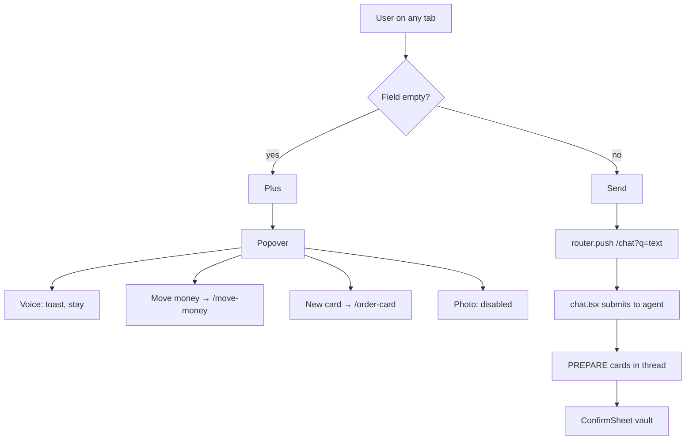
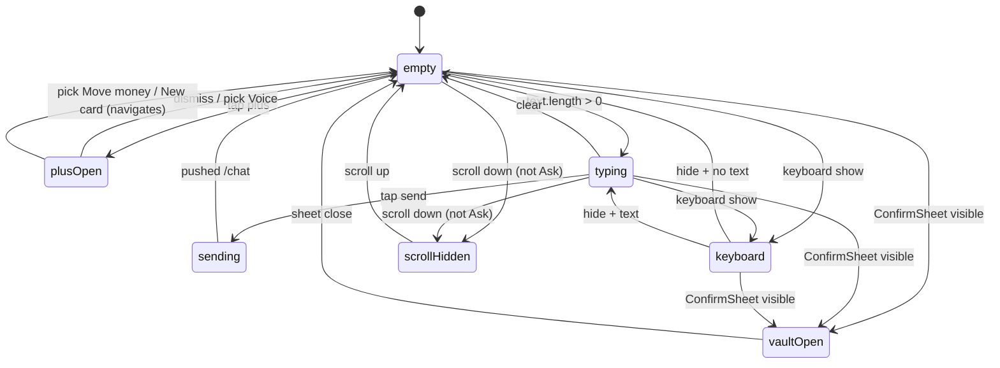
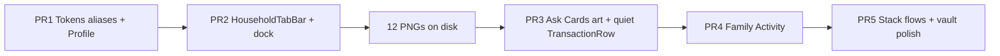

# Sunlit Household UI Revamp

| Field | Value |
|---|---|
| **Document** | FastCards visual system replacement |
| **Author** | Engineering (draft for implementation) |
| **Date** | 2026-08-19 |
| **Status** | Draft |
| **Product** | FastCards — Expo SDK 57, React Native 0.86, expo-router (`src/app`) |
| **Scope** | UI-only. SpacetimeDB, gateway, CopilotKit trust boundary, and execute path are unchanged. |
| **Replaces** | Obsidian / Quiet Intelligence (`src/design/tokens.ts`, CLAUDE.md Visual Direction, UI spec dark palette) |

This document is the implementation contract for the visual and interaction revamp. An implementer should be able to execute it without product-owner follow-ups on locked decisions. Former open questions are **Resolved** below.

---

## Overview

FastCards currently ships as a dark, Kast-inspired neobank: Inter, mint CTAs, a Skia morphing tab bar, a metal `LinearGradient` payment card, and a mesh-gradient Cards hub. Token canvas is `#050506`; splash/`app.json` `backgroundColor` is `#070908` (CLAUDE.md Obsidian). Both go away. That system is **Obsidian / Quiet Intelligence**. It reads as a crypto OS, not a family money product.

This revamp replaces it with **Sunlit Household** (default light) and **Night Household** (in-app dark). Personality: warm Indian-garden family neobank — cream paper, terracotta as the only brand fill, Fraunces for titles and hero money, Plus Jakarta Sans for UI, and twelve block-print plastic card faces. Color lives on objects (members, cards, chips, active nav, primary buttons, progress). Paper, body copy, money amounts, and execute facts stay quiet.

The shell changes with the palette: **`HouseholdTabBar`** — a rewrite of copied Reacticx `stack-aware-tabs`, not a wrap — is a full-width labeled cream/espresso pill replacing `KastTabBar` / morphing-tab-bar. A global **Ask dock** (rounded cream bar, rotating placeholders, custom 44×44 plus→send morph) sits above the tab pill on all four tabs and replaces the sticky `Composer` on Ask Home. Confirmation remains a cream **vault sheet** with no floral, no colored money, and no dock covering the CTA. Freeze/unfreeze stays a native control + toast (not a vault).

Nothing about money movement, permissions, or AI authority changes. EXECUTE still goes through `prepareAndExecute` in `src/domain/store.tsx` and `ConfirmSheet`. This is a presentation-layer rewrite.

---

## Background & Motivation

### Current state (cite)

| Surface | File | What it does today |
|---|---|---|
| Tokens | `src/design/tokens.ts` | Single dark dictionary. Token `bg` `#050506` (not the splash hex). Mint `#46E6A2`, Inter font keys. |
| Type | `src/design/AppText.tsx` | Inter 400/500/600/700. Hero 46 / balance 36 / title 28. |
| Root | `src/app/_layout.tsx` | Loads Inter, forces `DarkTheme`, `StatusBar style="light"`, `contentStyle` `color.bg`. |
| Tabs | `src/app/(tabs)/_layout.tsx` + `src/components/fin/KastTabBar.tsx` | Four tabs via Reacticx `MorphicTabBar` (Skia, text-only, floating). |
| Ask Home | `src/app/(tabs)/index.tsx` | Sticky `Composer` (`src/components/ask/Composer.tsx` on `bottom-input-bar`). Quick actions duplicate plus-menu intents (Send, New card). Avatar opens an `Alert`, not a profile screen. |
| Cards | `src/app/(tabs)/cards.tsx` | Custom Reanimated carousel + **forbidden** `AnimatedMeshGradient`. |
| Card face | `src/components/fin/PaymentCardVisual.tsx` | Metal `LinearGradient`, wordmark, chip, last-4. Status badge on-card. |
| Theme hook | `src/hooks/use-theme.ts` + `src/constants/theme.ts` | Template light/dark `Colors`, unused by product screens. |
| App chrome | `app.json` | `"userInterfaceStyle": "dark"`, splash/`backgroundColor` `#070908` (differs from token `bg` `#050506`). Android `adaptiveIcon.backgroundColor` still `#E6F4FE`. No `softwareKeyboardLayoutMode` (Expo 57 default **`resize`**). |
| Seeded cards | `server/spacetimedb/src/index.ts` | `c-personal`, `c-maya`, `c-arjun`, `c-dad`, `c-subs`, `c-amzn`. |

### Pain points

1. Obsidian + mint is a crypto-wallet look. The product promise is “Money that understands your family.”
2. Metal card materials contradict the locked “colorful plastic, Indian garden block-print” direction.
3. Morphing-tab-bar is a Reacticx demo motif (curved/morphing). Forbidden going forward.
4. Mesh-gradient wallpaper on Cards hub is explicitly forbidden on money screens.
5. Ask composer is trapped on Ask Home; other tabs have no way to start a conversation without switching tabs.
6. No real Profile screen, so there is nowhere legal to put an in-app theme toggle.
7. `color.mint` is overloaded as brand, success, incoming money, and selected-tab — it cannot survive a terracotta brand + quiet money rule.
8. Light theme is impossible with the current single dictionary and `userInterfaceStyle: "dark"`.

### Constraints that do not move

- Four tabs only: Ask · Cards · Family · Activity.
- AI is READ/PREPARE; EXECUTE is gateway + ConfirmSheet.
- Native control surface for every important financial capability.
- No secrets in AI chat. PAN/CVV only after biometrics + `api.cardSensitive`.
- SpacetimeDB remains system of record. No schema/reducer work in this revamp.
- Accessibility from day one: dynamic type, contrast, 44pt, status not color-alone, reduced motion.

---

## Goals & Non-Goals

### Goals

1. Ship **Sunlit Household** as the default visual system and **Night Household** as a first-class in-app dark mapping (1:1 tokens).
2. Replace Inter with **Fraunces** (titles, hero balances) + **Plus Jakarta Sans** (UI, tabs, tabular row money).
3. Replace morphing tab bar with **`HouseholdTabBar`** (rewrite of copied `stack-aware-tabs`: full-width, icon + Jakarta label, cream/espresso pill).
4. Ship a **global Ask dock** on all four tabs; remove the Ask Home sticky composer. Drop Ask Home **Shop**. Voice = toast until after MVP.
5. Rewrite `PaymentCardVisual` to **image faces** (12 Grok Imagine block-print plastics) with RN-composited type, chip, contactless, and espresso scrim.
6. Restyle every route in `src/app` plus auth screens to the new tokens, including loading/empty/error/permission/offline.
7. Keep the execute/confirmation path visually quieter than the rest of the app (cream vault, no floral, no dock overlap).
8. Land in five independently mergeable PRs (tokens → shell → Ask/Cards → Family/Activity → flows).

### Non-goals (explicit will-not-do)

See also **What we explicitly will not do**.

- No backend, reducer, KripiCard, Privy, or agent-tool changes.
- No fifth tab. No Rewards/Crypto/Profile tab.
- No Obsidian leftover palette. No mint-as-brand. No metal cards.
- No Skia `theme-switch` full-screen ripple. No morphing-tab-bar. No mobile-dock. No curved tabs.
- No shaders as wallpaper (aurora, energy-orb, siri-orb, liquid-metal, chroma-ring, shockwave, grainy-gradient, mesh-gradient, wave-scrawler).
- No System appearance option. Light is default; Night is an in-app opt-in.
- No custom garden-line tab icons in this revamp (PR2 = Ionicons outlines; later polish = 22pt / 1.5pt-stroke garden-line icons, no bar rewrite).
- No Photo capture/send flow (menu item exists, **disabled** with “Coming later”).
- No Ask Home **Shop** action (today’s `notYet('AI shopping')` is deleted, not restyled).
- No Voice input in MVP — plus-menu Voice and thread-composer mic both toast “Voice arrives after MVP.”
- No unmodified wrap of Reacticx `stack-aware-tabs`, `flexi-button`, or `scale-carousel` as the plan of record.
- No rewrite of `AI_FAMILY_NEOBANK_UI_SPEC.md` / `CLAUDE.md` in these PRs — listed as follow-up.
- No CopilotKit visual ownership. Known renderers stay in `src/components/ask/blocks.tsx`.

---

## Key Decisions

Locked in the grilling session unless noted as an implementation decision.

| # | Decision | Rationale |
|---|---|---|
| K1 | Visual world is **Sunlit Household** (default) + **Night Household** (in-app). Obsidian is deleted. | Family neobank, Indian garden, not crypto OS. |
| K2 | Light is default. Theme toggle lives **only** on Profile (avatar → `/profile`). Reacticx `animated-theme-toggle` (SVG). | No settings scatter. No Skia ripple. |
| K3 | Tokens are a dual dictionary with identical keys. Screens never branch on hex. | 1:1 mapping; Night is not a restyle, it is a swap. |
| K4 | **Accented objects, quiet paper.** Color on members/cards/chips/active nav/primary buttons/progress only. | Money amounts, body, execute facts, PAN/CVV stay espresso/cream. Trust > decoration. |
| K5 | Brand fill is terracotta `#E06A3A`. Success mint is `#1B9A6C` (Sunlit). Mint is no longer brand. | Separates CTA from “it worked.” Light-mode contrast. |
| K6 | Interaction primitives everywhere, shaders almost never. Reacticx is the motion chassis; FastCards owns financial primitives. | Avoids a component-gallery look. |
| K7 | Cards are **colorful plastic block-print**, 12 Imagine faces, same assets in Night. Frozen = same art desaturated + Frozen badge off-card. | Not metal. Identity is the garden, not a sheen. |
| K8 | `PaymentCardVisual` is `expo-image` (active) or Skia `Image`+`ColorMatrix` (frozen/closed) + overlay. Type/chip/last-4 are composited in RN. Never wrap `expo-image` in Skia ColorMatrix. | Imagine art must not contain credentials. Skia filters only Skia children. |
| K9 | Four tabs stay. **`HouseholdTabBar` rewrites** copied `stack-aware-tabs` (full-width labeled pill). Do not wrap the unmodified copy (`maxWidth: 200`, no labels, `#101010` bar). | Icon + Jakarta 11 label, selected icon scales 1.12. No morphing bar, no BlurView. |
| K10 | Global Ask dock on all four tabs. Plus (empty) morphs to Send (text). Plus menu: Voice · Move money · New card · Photo. | Composer is a household verb, not an Ask-tab widget. |
| K11 | Send from dock always `router.push({ pathname: '/chat', params: { q } })`. PREPARE cards never render in the dock. | Keeps HITL on the conversation surface. |
| K12 | Dock hides on scroll-down (Cards/Family/Activity), never on Ask Home, never covers a vault CTA. | ConfirmSheet is the trusted surface. |
| K13 | Confirmation is a **cream vault sheet**. No floral, no colored money, one consequence-named button. **Freeze/unfreeze is exempt** — native control + toast, as today (`cards.tsx` dispatch). | Execute path is quieter than browse. Freeze is reversible and already a first-class card control. |
| K14 | Flip-card for PAN **only** after biometrics + `api.cardSensitive`. Existing `card/[id].tsx` auth flow stays. | Secrets never in chat; never on an unauthenticated face. |
| K15 | Motion: 180–280 ms springs. Reduced motion: snap, no springs, no carousel tilt. | Friendly, not decorative. |
| K16 | **Implementation:** introduce `src/app/profile.tsx` (missing today). Avatar currently `Alert`s; it must navigate to Profile because that is the only legal home for the theme toggle. | Spec UI §37 already required this screen. |
| K17 | **Implementation:** split `color.mint` (success) from `color.accent` (terracotta). Do not remap `color.mint` → terracotta. | Prevents success/incoming/approval chrome from going orange. |
| K18 | **Implementation:** persist theme in SecureStore key `fastcards.appearance.mode` (`sunlit` \| `night`). Do not follow OS. On change, `Appearance.setColorScheme` so keyboard/status bar match. | Locked “in-app toggle only.” |
| K19 | **Implementation:** resolve card art by **`memberId` then variant**, then seed id. Mapping lives in `src/design/cardArt.ts`, not in SpacetimeDB. New Maya/Arjun/Dad cards keep their garden. | Identity is the garden per person, not a seed-id lookup that misses `order-card`. |
| K20 | **Implementation:** `Screen` reports scroll direction (`scrollEventThrottle={16}`) and exposes `scrollToTopRef`. Ask Home’s custom `ScrollView` registers the **same** `scrollToTopRef` (or a dock-context register) **and** `setAskHome(true)` in `useFocusEffect`. Dock is a **sibling overlay of the full `Tabs` layout** in `(tabs)/_layout.tsx` (`bottom = tabBarHeight + 8` closed, `bottom = keyboardHeight + 8` open). `vaultOpen` is **defensive**. | One dock. Re-tapping Ask scrolls to top. |
| K21 | **Implementation:** PR1 keeps **deprecated aliases** on `ColorTokens`: `surface1→cream`, `surface2→raised`, `surface3→inset`, `borderSoft→line`, `borderStrong→lineStrong`, `success→mint`, `gold`/`goldDim` for the EMV chip until PR3 (`chipGold`). Do not delete old keys until a cleanup after PR5. | ~35 files / 100+ sites still read `color.surface1` etc. PR1 must `tsc --noEmit`. |
| K22 | **Implementation:** copy `stack-aware-tabs` then **rewrite** into `HouseholdTabBar` in PR2 (budget: a full tab-bar file, not a theme-prop wrap). No pan-scrub if it fights the Cards carousel. | Upstream component cannot meet K9. |
| K23 | **Implementation:** `app.json` `android.softwareKeyboardLayoutMode: "pan"` (requires a native rebuild). Position the dock from keyboard frame listeners **without** adding height if the window already resized. Rejected: `tabBarHideOnKeyboard: true` (hides the four-tab IA while typing on Ask). | Expo 57 Android default is `resize`; tabs would rise and double-offset the dock. |
| K24 | **Implementation:** `Member.hueId` is **required** on the DTO; mapper does **not** bake `accentColor`. **PR3 migrates the Avatar/`hueId` call sites** in `MemberBudgetCard.tsx`, `member/[id].tsx`, `ApprovalCard.tsx`, and `primitives.Avatar` (even if those screens restyle later). Views resolve `colors.member[member.hueId]`. Unknown members → `pool`. | Otherwise Family/Approvals pass `accent={undefined}` on main after PR3. |
| K25 | **Implementation:** PR1 Profile **must** ship Appearance + Admin (if `session.isAdmin`) + Sign out. DomainProvider **error** screen also gets Sign out (Profile is inside the domain gate). | Avatar Alert is the only Sign out/Admin path today; removing it without those rows regresses until PR5. |
| K26 | **Implementation:** `TransactionRow` quiet-money (espresso amount; mint “Received” caption; strikethrough + `errorInk` “Declined”) lands in **PR3**, before Ask Home ships with recent rows. Ban default-arg token capture (`tone = color.textPrimary`). `TextButton` default `tone` → `accentInk` in PR1. | Quiet-paper rule is visible on Ask; `TextButton` mint default would become success green. |
| K27 | **Implementation:** keep the existing Reanimated `FlatList` carousel (retune 0.92/1/0.92, delete mesh). **scale-carousel is an optional spike**, not the plan of record. Plus→send is a **custom 44×44** morph, not `flexi-button`. Plus menu is a **product 4-row popover only** — no Reacticx `dropdown` spike. Photo is disabled with “Coming later.” | Those Reacticx primitives are demo-gallery (3D tilt, icon→text expand, glass). |
| K28 | **Implementation:** (a) scene `paddingBottom` = `space.dockClearance` (~64–104), **not** tab+dock+safe area — the tab bar already occupies layout. (b) Dock uses `borderRadius: 24` **or** `npx expo install @react-native-masked-view/masked-view` before `squircle-view` (it is not a direct dep). (c) Hide network mark unless a real issuer field exists — **do not hardcode RuPay**. (d) PR3 does not start until 12 PNGs exist. (e) Boot: `Appearance.setColorScheme('light')` at module load; keep splash until fonts **and** SecureStore hydrate. | Layout, Metro, chrome flash, and factual network mark. |

---

## Proposed Design

### System metaphor

Sunlit Household is **paper, garden, plastic**. The app is a cream notebook; the colorful things are the family’s cards and people. Night Household is the same notebook after lights-out: warm espresso canvas, cream type, same garden objects slightly brighter so they still read.



### High-level architecture



### File-level target tree (new/changed)

```
src/design/tokens.ts              # dual palettes + space/radius/font/duration/shadow
src/design/theme.tsx              # NEW ThemeProvider, useTheme, useColors
src/design/AppText.tsx            # Fraunces + Jakarta variants
src/design/cardArt.ts             # NEW roster mapping + require() assets
src/design/motion.ts              # NEW springs + useReduceMotion
src/app/_layout.tsx               # fonts, ThemeProvider, StatusBar, splash
src/app/(tabs)/_layout.tsx        # HouseholdTabBar + AskDock
src/app/profile.tsx               # NEW: Appearance + Admin + Sign out (PR1)
src/components/fin/HouseholdTabBar.tsx  # NEW, replaces KastTabBar
src/components/ask/AskDock.tsx    # NEW global dock
src/components/ask/PlusMenu.tsx   # NEW compact popover
src/components/ask/AskDockContext.tsx
src/components/fin/PaymentCardVisual.tsx  # image + overlay rewrite
src/components/fin/ConfirmSheet.tsx       # cream vault, reports vaultOpen
src/components/fin/Buttons.tsx            # terracotta primary
src/components/fin/Screen.tsx             # paper bg, scroll reporter
app.json                          # light default, splash paper
assets/cards/*.png                # 12 faces
assets/images/splash-icon.png     # terracotta-on-paper mark
```

`src/constants/theme.ts` and `src/hooks/use-theme.ts` are template leftovers (`use-theme.ts` is OS `Colors.light/dark`, unused by product screens). **Grep, then delete** with `themed-text.tsx` / `themed-view.tsx` if nothing imports them. Re-export only if a leftover import would otherwise break `tsc`. Do not keep a second theme API.

---

## Theme architecture

### Provider stack (PR1)

`src/app/_layout.tsx` today:

```32:42:src/app/_layout.tsx
const obsidianTheme = {
  ...DarkTheme,
  colors: {
    ...DarkTheme.colors,
    background: color.bg,
    card: color.raised,
    border: color.borderSoft,
    text: color.textPrimary,
    primary: color.mint,
  },
};
```

Replace with a product `ThemeProvider` that owns mode, then feed expo-router a derived navigation theme.

```tsx
// src/design/theme.tsx — target shape
import * as SecureStore from 'expo-secure-store';
import { Appearance, AccessibilityInfo } from 'react-native';
import { palettes, type ColorTokens, type ThemeName } from './tokens';

const STORE_KEY = 'fastcards.appearance.mode';

type ThemeContextValue = {
  mode: ThemeName;                 // 'sunlit' | 'night'
  colors: ColorTokens;
  setMode: (mode: ThemeName) => void;
  toggleMode: () => void;
  reduceMotion: boolean;
  ready: boolean;                  // SecureStore hydrated
};

export function ThemeProvider({ children }: React.PropsWithChildren): React.JSX.Element;
export function useTheme(): ThemeContextValue;
export function useColors(): ColorTokens;
```

**Boot sequence**

1. **Module load** (top of `src/app/_layout.tsx`, before any component): `Appearance.setColorScheme('light')`. This races the OS: `userInterfaceStyle: "automatic"` would otherwise let a dark OS paint a dark keyboard/status bar while JS still thinks Sunlit.
2. Keep the splash visible until **both** `fontsLoaded` **and** `ThemeProvider.ready` (SecureStore read). SecureStore is typically one frame; do not hide splash on fonts alone (`_layout.tsx` today hides at lines 72–74).
3. Then, in one commit: apply stored mode (`sunlit` | `night`), `Appearance.setColorScheme(mode === 'night' ? 'dark' : 'light')`, `SystemUI.setBackgroundColorAsync(colors.bg)`, StatusBar style.
4. Remaining risk: one native chrome frame before JS runs. Accept it; do not invent a native splash plugin for Night. Night users may see a paper splash (splash is pre-toggle, always `#FFF8F1`) then the espresso canvas — that is correct, not a flash of Obsidian.
5. expo-router `ThemeProvider` value is `SunlitNavTheme` or `NightNavTheme` built from tokens (`background`, `card`, `border`, `text`, `primary: colors.accent`).

**What is not a theme source**

- `useColorScheme()` from `src/hooks/use-color-scheme.ts` is **not** the product theme. OS dark does not flip the app.
- `src/constants/theme.ts` `Colors.light/dark` is the Expo template. Stop using it in product screens.

**Native chrome**

| Knob | Sunlit | Night |
|---|---|---|
| `app.json` `userInterfaceStyle` | `"automatic"` (so Night can request dark keyboard/chrome **after** JS sets scheme) | same |
| `app.json` `backgroundColor` | `#FFF8F1` | overridden at runtime via `expo-system-ui` `setBackgroundColorAsync(colors.bg)` |
| `app.json` `android.softwareKeyboardLayoutMode` | `"pan"` (PR2; requires rebuild) | same |
| Splash `backgroundColor` | `#FFF8F1` | N/A (splash is always paper; Night applies after hide) |
| `Appearance.setColorScheme` | `'light'` at module load, then stored mode | `'dark'` after hydrate |
| Status bar | dark-content, paper bg | light-content, espresso bg |
| Keyboard appearance | default/light | dark |
| Android adaptive icon / iOS `expo.icon` | **Out of band** with this revamp (still Expo template blue `#E6F4FE`). Splash mark in PR1 if ready. | same |

**Reacticx theming**

`HouseholdTabBar` does **not** take Reacticx `light`/`dark` objects — we rewrite the copy and paint from `useColors()`. `animated-theme-toggle` (Profile only) props: `isDark`, `onToggle`, `size`, `duration`, `color`, `strokeWidth`. Bind `isDark={mode === 'night'}`, `color={colors.textPrimary}`, `duration={220}`.

**Persistence**

- Key: `fastcards.appearance.mode`
- Values: `'sunlit'` | `'night'`
- Store: `expo-secure-store` (already a plugin). There is **no AsyncStorage** in `package.json`; SecureStore is the justified persistence, same pattern as `fc.devUserId` in `src/auth/AuthContext.tsx`. The value is not a secret.
- Missing/corrupt → `'sunlit'`.
- Toggle is the only writer.

**Reduced motion vs haptics**

`src/design/motion.ts` subscribes to `AccessibilityInfo.isReduceMotionEnabled()` + `reduceMotionChanged`. Springs, rolling counters, carousel scale, plus→send morph, and tab icon scale consult **reduce motion**. When true: duration `0` or `80` snap, no `withSpring`, carousel scale all `1`, rolling counter jumps.

Haptics are **independent**. `Haptics.selectionAsync()` / `notificationAsync` consult OS haptic settings only (spec §47). Do not skip haptics because `reduceMotion` is true.

---

## Full token dictionaries

### TypeScript shape

```ts
// src/design/tokens.ts

export type ThemeName = 'sunlit' | 'night';

export type MemberHueId =
  | 'rohan' | 'maya' | 'arjun' | 'dad'
  | 'subscriptions' | 'protected' | 'groceries' | 'teen'
  | 'merchant' | 'pool' | 'custom' | 'temporary';

export interface MemberHue {
  fill: string;     // avatar wash, chip fill, progress
  ink: string;      // initials, chip label on paper
  dim: string;      // 14–18% wash behind avatar
}

export interface ColorTokens {
  // Paper stack
  bg: string;            // app canvas
  cream: string;         // grouped sections
  raised: string;        // dock, sheets, raised tiles
  inset: string;         // pressed / inset
  line: string;          // hairline borders
  lineStrong: string;    // elevated / vault border

  // Type
  textPrimary: string;
  textSecondary: string;
  textTertiary: string;
  textDisabled: string;

  // Brand (terracotta)
  accent: string;
  accentBright: string;  // pressed
  accentDim: string;     // wash
  accentInk: string;     // terracotta text on paper (small labels)
  onAccent: string;      // label on terracotta fill

  // Success mint (NOT brand)
  mint: string;
  mintBright: string;
  mintDim: string;
  mintBorder: string;
  mintInk: string;       // mint text on paper
  onMint: string;

  // Semantic
  warning: string;
  warningDim: string;
  warningInk: string;
  error: string;
  errorDim: string;
  errorInk: string;
  info: string;
  infoDim: string;
  infoInk: string;

  // Overlay + on-card ink
  overlay: string;       // modal scrim
  scrim: string;         // card-face bottom gradient end (espresso @ ~70%)
  onCard: string;        // type composited on floral (cream, both themes)
  chipGold: string;      // EMV chip fill
  chipGoldStroke: string;

  // Member / card hues (12)
  member: Record<MemberHueId, MemberHue>;

  // Deprecated aliases — required through PR5 so leftover StyleSheets typecheck.
  // Same hex as the canonical key. New code must not use these names.
  surface1: string;      // = cream
  surface2: string;      // = raised
  surface3: string;      // = inset
  borderSoft: string;    // = line
  borderStrong: string;  // = lineStrong
  success: string;       // = mint
  gold: string;          // = chipGold (EMV only)
  goldDim: string;       // Night/Sunlit dim well behind chip if needed
}

export const space = {
  xs: 4, s: 8, m: 12, l: 16, xl: 20, xxl: 24, x32: 32, x40: 40,
  /** Scene paddingBottom above an occupying tab bar so content clears the overlay dock. Not tab+safe. */
  dockClearance: 72, // 56 dock + 8 gap; grow to 104 if the field is multiline
} as const;

export const screenPad = 20;

export const radius = {
  chip: 10,
  control: 14,
  tile: 18,
  card: 22,
  dock: 24,       // Ask dock squircle
  sheet: 28,
  pill: 999,
} as const;

export const font = {
  // Fraunces — titles + hero money
  displayRegular: 'Fraunces_400Regular',
  displayMedium: 'Fraunces_500Medium',
  displaySemibold: 'Fraunces_600SemiBold',
  displayBold: 'Fraunces_700Bold',
  // Plus Jakarta Sans — UI + tabular row money
  regular: 'PlusJakartaSans_400Regular',
  medium: 'PlusJakartaSans_500Medium',
  semibold: 'PlusJakartaSans_600SemiBold',
  bold: 'PlusJakartaSans_700Bold',
} as const;

export const duration = {
  state: 180,     // press, chip, badge
  nav: 240,       // tabs, dock hide/show, plus→send
  sheet: 280,     // vault spring
} as const;

export const shadow = {
  sunlit: {
    dock:  { color: 'rgba(28,22,18,0.10)', offset: { width: 0, height: 8 },  opacity: 1, radius: 20, elevation: 8 },
    tile:  { color: 'rgba(28,22,18,0.06)', offset: { width: 0, height: 4 },  opacity: 1, radius: 12, elevation: 3 },
    sheet: { color: 'rgba(28,22,18,0.18)', offset: { width: 0, height: -8 }, opacity: 1, radius: 24, elevation: 16 },
  },
  night: {
    dock:  { color: 'rgba(0,0,0,0.40)', offset: { width: 0, height: 8 },  opacity: 1, radius: 20, elevation: 8 },
    tile:  { color: 'rgba(0,0,0,0.28)', offset: { width: 0, height: 4 },  opacity: 1, radius: 12, elevation: 3 },
    sheet: { color: 'rgba(0,0,0,0.50)', offset: { width: 0, height: -8 }, opacity: 1, radius: 24, elevation: 16 },
  },
} as const;

export const icon = { default: 21, meta: 17, tab: 22 } as const;

export const sunlit: ColorTokens = { /* table below */ };
export const night: ColorTokens = { /* table below */ };

export const palettes: Record<ThemeName, ColorTokens> = { sunlit, night };

/** Static default = Sunlit, including aliases. Leftover StyleSheets keep compiling. Night requires useColors(). */
export const color = sunlit;
```

Static `StyleSheet.create` cannot see theme. Pattern for converted files:

```tsx
const colors = useColors();
const styles = useMemo(() => makeStyles(colors), [colors]);
```

**PR1 converts only** `AppText`, `Buttons` (terracotta primary; `TextButton` default `tone = colors.accentInk`), `Screen`/`Panel`, `Toast` to `useColors()`. Other files keep `import { color }` and typecheck because aliases exist. **Do not remove aliases until a cleanup after PR5.**

**Night QA after PR1:** the toggle is for **Profile + converted primitives only**. Do **not** QA Night on Cards / Family / Activity until those PRs — those children still import static Sunlit `color.textPrimary` (`#1C1612`). With a Night `Screen` canvas (`#1C1612`) that is espresso-on-espresso, not “wrong hex.” Ask Home does not use `Screen`, so its snapshot is safer, but recent rows still use unconverted `TransactionRow` until PR3. Do not delay `Screen` canvas theming — Profile needs Night paper/espresso with converted `AppText`.

Ban default-arg token capture:

```ts
// BAD — evaluated once at module load against sunlit
export function RollingMoney({ tone = color.textPrimary }: ...) {}
export function TextButton({ tone = color.mint }: ...) {}

// GOOD
const colors = useColors();
<RollingMoney tone={colors.textPrimary} />
<TextButton tone={colors.accentInk} />
```

### Sunlit Household — color table

| Token | Hex | Use |
|---|---|---|
| `bg` | `#FFF8F1` | App canvas (Paper) |
| `cream` | `#FFF1E4` | Grouped sections, insight card, member tiles wash |
| `raised` | `#FFFFFF` | Dock, sheets, raised tiles, tab pill track |
| `inset` | `#F4E6D8` | Pressed, inset wells, segmented track |
| `line` | `#E8D5C4` | Hairline borders |
| `lineStrong` | `#D4B8A2` | Vault/sheet edge, focused input |
| `textPrimary` | `#1C1612` | Espresso — titles, body, **all money amounts** |
| `textSecondary` | `#6B5E55` | Clay — supporting copy |
| `textTertiary` | `#8F8278` | Captions, timestamps, placeholders |
| `textDisabled` | `#C4B6AA` | Disabled labels |
| `accent` | `#E06A3A` | Terracotta — primary CTA fill, active tab, plus→send |
| `accentBright` | `#EC7A4C` | Pressed terracotta |
| `accentDim` | `#F8E0D4` | Terracotta wash (selected chip) |
| `accentInk` | `#C24E28` | Terracotta text on paper (never < 14pt semibold) |
| `onAccent` | `#FFF8F1` | Label on terracotta fill, ≥16pt medium, minHeight 50 |
| `mint` | `#1B9A6C` | Success fill, progress “healthy”, credit caption |
| `mintBright` | `#22B37D` | Pressed success |
| `mintDim` | `#D7F0E4` | Success wash |
| `mintBorder` | `#8FCFB0` | Success/receipt border |
| `mintInk` | `#0F7A54` | Success text on paper (small) |
| `onMint` | `#FFF8F1` | Text on mint fill |
| `warning` | `#D8902A` | Warning fill (darkened vs old `#F3B84B` for paper contrast) |
| `warningDim` | `#F8E9CC` | Warning wash |
| `warningInk` | `#9A6410` | Warning text on paper |
| `error` | `#D6454A` | Error fill (slightly darkened vs `#FF6B70`) |
| `errorDim` | `#F8D6D7` | Error wash |
| `errorInk` | `#B42328` | Error text on paper |
| `info` | `#3D6FDB` | Info fill (darkened vs `#7AA7FF`) |
| `infoDim` | `#D9E4FA` | Info wash |
| `infoInk` | `#2A54B8` | Info text on paper |
| `overlay` | `rgba(28,22,18,0.46)` | Modal scrim |
| `scrim` | `rgba(28,22,18,0.70)` | Card-face bottom gradient end |
| `onCard` | `#F4EDE4` | Nickname / last-4 on floral (not paper) |
| `chipGold` | `#E8C98A` | EMV chip fill |
| `chipGoldStroke` | `#C9A96A` | EMV chip stroke |

Owner cards are marigold plastic, not metal. `gold`/`goldDim` aliases remain for the chip until PR3 rewrites `PaymentCardVisual`.

### Night Household — color table (1:1)

| Token | Hex | Use |
|---|---|---|
| `bg` | `#1C1612` | Espresso canvas |
| `cream` | `#221C17` | Grouped sections (between bg and raised) |
| `raised` | `#261E18` | Tiles, dock, sheets |
| `inset` | `#1A1511` | Pressed / inset |
| `line` | `#3A3028` | Hairline |
| `lineStrong` | `#4A3E34` | Elevated edge |
| `textPrimary` | `#F4EDE4` | Cream type |
| `textSecondary` | `#C4B6AA` | Secondary |
| `textTertiary` | `#8F8278` | Captions |
| `textDisabled` | `#5C524A` | Disabled |
| `accent` | `#F07A4A` | Terracotta nudged brighter |
| `accentBright` | `#F58B60` | Pressed |
| `accentDim` | `#3A241C` | Wash |
| `accentInk` | `#F07A4A` | Terracotta text on espresso |
| `onAccent` | `#1C1612` | Label on bright terracotta (espresso, not cream — contrast) |
| `mint` | `#3DD68C` | Success brighter |
| `mintBright` | `#5EE4A4` | |
| `mintDim` | `#1A3A2C` | |
| `mintBorder` | `#2A6A4C` | |
| `mintInk` | `#3DD68C` | |
| `onMint` | `#1C1612` | |
| `warning` | `#E8B44A` | |
| `warningDim` | `#3A2E14` | |
| `warningInk` | `#E8B44A` | |
| `error` | `#FF7A7E` | |
| `errorDim` | `#3A1C1E` | |
| `errorInk` | `#FF7A7E` | |
| `info` | `#8AB0FF` | |
| `infoDim` | `#1C2840` | |
| `infoInk` | `#8AB0FF` | |
| `overlay` | `rgba(8,6,4,0.72)` | |
| `scrim` | `rgba(12,8,6,0.78)` | Same espresso family, slightly heavier |
| `onCard` | `#F4EDE4` | Same cream on floral as Sunlit |
| `chipGold` | `#E8C98A` | Same EMV chip |
| `chipGoldStroke` | `#C9A96A` | |

Night **onAccent** is espresso on brighter terracotta because cream-on-bright-orange fails contrast. Primary buttons stay ≥50pt height / ≥16pt medium.

### Old → new mapping (PR1 aliases)

| Legacy key (keep through PR5) | Canonical | Sunlit hex | Notes |
|---|---|---|---|
| `surface1` | `cream` | `#FFF1E4` | `Panel`, grouped tiles |
| `surface2` | `raised` | `#FFFFFF` | Pressed-adjacent, user bubbles |
| `surface3` | `inset` | `#F4E6D8` | Toast bg today (`store.tsx` / `Toast.tsx`), wells |
| `borderSoft` | `line` | `#E8D5C4` | Hairline |
| `borderStrong` | `lineStrong` | `#D4B8A2` | Focused / vault edge |
| `success` | `mint` | `#1B9A6C` | Do **not** alias to terracotta |
| `gold` | `chipGold` | `#E8C98A` | EMV chip only |
| `goldDim` | — | `#F8E6CC` Sunlit / `#3A2A14` Night | Chip well; unused after PR3 |
| `mint` (legacy brand) | `mint` (now success only) | `#1B9A6C` | Brand moves to `accent` |
| `TextButton` default `color.mint` | `accentInk` | `#C24E28` | Change in PR1 Buttons.tsx |

### Contrast measurements (sRGB WCAG 2.1)

| Pair | Contrast | Verdict |
|---|---|---|
| Sunlit espresso `#1C1612` on paper `#FFF8F1` | ~14:1 | Pass AAA |
| Sunlit clay `#6B5E55` on paper | ~5.8:1 | Pass AA |
| Sunlit `accentInk` `#C24E28` on paper | **4.52:1** | Pass AA (14pt+). Never smaller. |
| Sunlit terracotta fill `#E06A3A` + `onAccent` `#FFF8F1` | **~3.2:1** | **Fail** normal text. Mitigation: ≥16pt medium, minHeight 50 (large-text regime). |
| Sunlit `mintInk` `#0F7A54` on paper | ~5.1:1 | Pass AA |
| Night cream type `#F4EDE4` on espresso `#1C1612` | ~14:1 | Pass AAA |
| Night `textTertiary` `#8F8278` on espresso `#1C1612` | **4.75:1** | Pass AA. Same hex as Sunlit tertiary; keep. |
| Night `textDisabled` `#5C524A` on espresso | **~2.4:1** | Fail AA. Acceptable **only** for disabled (WCAG 1.4.3 exemption). Do not use for captions. |
| Night `onAccent` espresso `#1C1612` on `#F07A4A` | **~6.4:1** | Pass AA |
| Night destructive espresso on `#FF7A7E` | **~7.1:1** | Pass AA |

### Member hues (12-card roster)

Same semantic identities in both themes; Night nudged brighter.

| Id | Roster | Sunlit fill / ink / dim | Night fill / ink / dim |
|---|---|---|---|
| `rohan` | 1 Personal marigold | `#E08A2A` / `#9A5A10` / `#F8E6CC` | `#F0A04A` / `#F0A04A` / `#3A2A14` |
| `maya` | 2 Everyday hibiscus | `#D4536A` / `#A03048` / `#F8D6DC` | `#F07A90` / `#F07A90` / `#3A1C24` |
| `arjun` | 3 School banana-leaf teal | `#2A8F7B` / `#176A5A` / `#D4EDE6` | `#3DB89A` / `#3DB89A` / `#14302A` |
| `dad` | 4 jasmine sand | `#C4A574` / `#7A6540` / `#F0E6D4` | `#DCC09A` / `#DCC09A` / `#32281C` |
| `subscriptions` | 5 lotus indigo | `#4A4E8A` / `#32366A` / `#DCDEEE` | `#6A70B8` / `#8A90D0` / `#1C1E38` |
| `protected` | 6 marigold stamps | `#D4A04A` / `#8A6418` / `#F8E8CC` | `#E8B85A` / `#E8B85A` / `#3A2E14` |
| `groceries` | 7 curry-leaf sage | `#5A8F5E` / `#3A6A3E` / `#DCEADC` | `#78B07A` / `#78B07A` / `#1C2E1C` |
| `teen` | 8 frangipani peach | `#E0896C` / `#A05038` / `#F8DED4` | `#F0A488` / `#F0A488` / `#3A241C` |
| `merchant` | 9 lotus lock plum | `#7A4A6A` / `#5A2E4C` / `#E8D6E0` | `#A06090` / `#C080B0` / `#2A1824` |
| `pool` | 10 mixed garden | `#C4785A` / `#8A4A32` / `#F4DCD0` | `#E09070` / `#E09070` / `#3A241C` |
| `custom` | 11 peony rose | `#C45A6E` / `#8A3044` / `#F4D6DC` | `#E07890` / `#E07890` / `#3A1C24` |
| `temporary` | 12 sparse jasmine lemon | `#C8B44A` / `#7A6A18` / `#F4EEC8` | `#E0CC66` / `#E0CC66` / `#322E14` |

`Member.accentColor` currently comes from a hash in `src/api/client.ts`:

```62:64:src/api/client.ts
const ACCENTS = ['#7AA7FF', '#46E6A2', '#F3B84B', '#A0A1A8', '#FF6B70', '#6EF0B6'];
const accentFor = (id: string) =>
  ACCENTS[Math.abs([...id].reduce((h, c) => (h << 5) - h + c.charCodeAt(0), 0)) % ACCENTS.length];
```

**Replace** the hash with a required `hueId` on the DTO. Do **not** resolve hex in the mapper.

```ts
// src/api/client.ts
const MEMBER_HUE: Record<string, MemberHueId> = {
  'm-rohan': 'rohan',
  'm-maya': 'maya',
  'm-arjun': 'arjun',
  'm-dad': 'dad',
};
function hueIdFor(memberId: string): MemberHueId {
  return MEMBER_HUE[memberId] ?? 'pool';
}
// mapMember: hueId: hueIdFor(m.id)  — no accentColor hex
```

```ts
// src/domain/types.ts
export interface Member {
  // ...
  hueId: MemberHueId;          // required
  accentColor?: string;        // deprecated; do not read in views
}
```

Views (`MemberBudgetCard`, `member/[id].tsx`, `ApprovalCard`, `primitives.Avatar`) migrate the **Avatar/`hueId` call site in PR3** — the same PR as the mapper. Full restyle of Family/Member/Approvals can wait for PR4/PR5, but those PRs must not revert to `member.accentColor`. Do **not** ship “no accentColor hex” without these four call sites.

```ts
const colors = useColors();
const hue = colors.member[member.hueId];
<Avatar backgroundColor={hue.dim} textColor={hue.ink} />
```

Unknown members → `pool`. Night then updates avatars on toggle.

### Color application rules (enforced in code review)

| Allowed to be colorful | Must stay paper/espresso |
|---|---|
| Payment card faces | Body copy |
| Member avatars, avatar-group rings | Hero and row **money amounts** (`textPrimary`) |
| RuleChip / status chips (icon + label, not color-alone) | Execute/confirmation fact values |
| Active tab icon + pill | PAN, CVV, expiry, cardholder name on vault |
| Primary buttons (terracotta fill) | Input text |
| Progress fills (member hue or mint/warning/error by threshold) | Tab bar inactive icons |
| Plus menu icons (small) | Vault sheet background |

Credits: do **not** color the rupee amount mint. Use espresso amount + a small mint “+” prefix or “Received” caption. Declines: espresso amount + strikethrough + “Declined” caption in `errorInk` + icon. Status is never color-alone.

**PR-order constraint:** `TransactionRow` currently sets credit amounts to `color.mint` (`src/components/fin/TransactionRow.tsx` 34–38) and Ask Home recent rows use it. Quiet-money **must ship in PR3** with Ask, not wait for PR4. `RollingMoney` / `AppText` must not default-arg `color.textPrimary` at import time.

### Space, radius, motion, shadow

Keep the 4pt grid (`space.*`, `screenPad = 20`). Radius as above — slightly friendlier than Kast, not pills-everywhere. Duration 180/240/280 matching the motion budget. Shadows are **warm espresso**, not black, on Sunlit; Night uses black at lower opacity. Do not add glow.

Spring config (unless reduced motion):

```ts
export const spring = { damping: 22, stiffness: 280, mass: 0.8 }; // ~220ms settle
export const springSheet = { damping: 26, stiffness: 240, mass: 0.9 };
```

---

## Typography implementation

### Packages

```bash
npx expo install @expo-google-fonts/fraunces @expo-google-fonts/plus-jakarta-sans
# remove @expo-google-fonts/inter after _layout.tsx no longer imports it
```

Load in `src/app/_layout.tsx` (replaces Inter block lines 6–12, 65–70):

```ts
import {
  Fraunces_400Regular, Fraunces_500Medium,
  Fraunces_600SemiBold, Fraunces_700Bold, useFonts as useFraunces,
} from '@expo-google-fonts/fraunces';
import {
  PlusJakartaSans_400Regular, PlusJakartaSans_500Medium,
  PlusJakartaSans_600SemiBold, PlusJakartaSans_700Bold,
  useFonts as useJakarta,
} from '@expo-google-fonts/plus-jakarta-sans';
```

Expo’s `useFonts` from either package can take a combined map; use one `useFonts({ ...Fraunces, ...Jakarta })` from `@expo-google-fonts/fraunces` **or** `expo-font`. Do not load italics in MVP.

### Optical size notes (Fraunces)

Static Google files ship at a default optical size. At 48–56pt Fraunces has high contrast and “wonk.” Compensate:

- Hero: `Fraunces_600SemiBold` (not 700/900), `letterSpacing: -0.4`, `lineHeight: fontSize * 1.12`.
- Screen title: `Fraunces_600SemiBold` 30 / tracking `-0.2`.
- Do not use Fraunces below 18pt. Body, tabs, chips, facts, last-4, PAN = Jakarta.

### AppText variants

```ts
// src/design/AppText.tsx
export type TextVariant =
  | 'hero' | 'balance' | 'screenTitle' | 'section'
  | 'cardTitle' | 'body' | 'secondary' | 'caption' | 'label';

// Sunlit example; colors come from useColors()
const variants = {
  hero:        { fontSize: 52, lineHeight: 58, fontFamily: font.displaySemibold, letterSpacing: -0.4 },
  balance:     { fontSize: 36, lineHeight: 42, fontFamily: font.displaySemibold, letterSpacing: -0.3 },
  screenTitle: { fontSize: 30, lineHeight: 36, fontFamily: font.displaySemibold, letterSpacing: -0.2 },
  section:     { fontSize: 18, lineHeight: 24, fontFamily: font.displayMedium },
  cardTitle:   { fontSize: 16, lineHeight: 22, fontFamily: font.semibold },      // Jakarta
  body:        { fontSize: 15, lineHeight: 22, fontFamily: font.regular },
  secondary:   { fontSize: 13, lineHeight: 18, fontFamily: font.regular },
  caption:     { fontSize: 12, lineHeight: 16, fontFamily: font.medium },
  label:       { fontSize: 11, lineHeight: 14, fontFamily: font.semibold, letterSpacing: 0.6, textTransform: 'uppercase' },
};
```

`tabular` prop: `fontVariant: ['tabular-nums']` + Jakarta (`font.medium` for row amounts). Plus Jakarta ships lining tabular figures; Fraunces tabular is weaker — **never tabular-Fraunces in rows**.

`RollingMoney` (`src/components/fin/RollingMoney.tsx`): add `variant: 'display' | 'ui'`.

- `display` (Ask hero, member remaining): Fraunces_600, digitWidth `fontSize * 0.58` (serif is wider than Inter).
- `ui` (Cards remaining 34pt if we keep rolling there): also Fraunces if it is a hero; Cards summary is a hero, so display.
- Hidden state: `₹ ••••••` in the same family.

Allow Dynamic Type: wrap sizes with a clamp against `PixelRatio.getFontScale()` so hero does not overflow (`Math.min(fontSize * scale, fontSize * 1.35)`). Minimum body 15.

`src/global.css` `--font-display` / `--font-serif` currently Spline Sans / Georgia. Point them at Fraunces / Plus Jakarta for web, or ignore if web is not a ship target this slice.

---

## Navigation

### Tabs

Four destinations remain, registered in `src/app/(tabs)/_layout.tsx`:

| Route file | `name` | Label | Placeholder icon (Ionicons outline) |
|---|---|---|---|
| `index.tsx` | `index` | Ask | `sparkles-outline` / filled `sparkles` when selected |
| `cards.tsx` | `cards` | Cards | `card-outline` / `card` |
| `family.tsx` | `family` | Family | `people-outline` / `people` |
| `activity.tsx` | `activity` | Activity | `time-outline` / `time` |

Replace `KastTabBar` with **`HouseholdTabBar`**: copy Reacticx `stack-aware-tabs` then **rewrite** it. Do not wrap the unmodified component.

```bash
npx reacticx add stack-aware-tabs
npx tsc --noEmit
# Then rewrite src/shared/ui/.../stack-aware-tabs (or copy into
# src/components/fin/HouseholdTabBar.tsx) until it matches the visual below.
```

**Why a rewrite (upstream cannot meet K9)**

Verified against https://www.reacticx.com/docs/components/stack-aware-tabs: `StackAwareTabBar` is `React.FC<BottomTabBarProps>` with hardcoded `#101010` bar, `#fff`/`#6b7280` icons, **no label rendering** (label is computed, never shown), `maxWidth: 200` (three-icon island, not four labeled tabs), `SCALE_UP = 1.2`, `expo-blur` glass on a nested-stack back button, no `light`/`dark` theme props. FastCards has **no nested stack inside tabs** — flows live on the root stack — so the “stack-aware” back button never appears.

**PR2 rewrite budget:** one new file `src/components/fin/HouseholdTabBar.tsx` (~150–250 lines) that *keeps* the selected-icon scale spring from the copy and *throws away* maxWidth island, BlurView, unlabeled icons, pan-scrub (pan-scrub fights the Cards horizontal carousel). Paint from `useColors()`. Delete `KastTabBar.tsx` in the same PR.

**Visual**

- Bar occupies layout (not an overlay): paper (`colors.bg`), full width, horizontal inset 16, height **56 + `insets.bottom` + 8**.
- Pill: Sunlit `raised` `#FFFFFF` with `line` border + light warm shadow; Night `raised` `#261E18`. Four equal columns, not a 200pt island.
- Inactive: outline icon 22pt + Jakarta 11 medium label, `textTertiary`.
- Active: filled icon scales 1 → **1.12** (spring 220ms, not 1.2), terracotta icon + label `accentInk` / Night `accent`. Moving cream/espresso pill behind the selected item.
- Hit target per tab ≥ 44×44.
- Light `Haptics.selectionAsync()` on change — **not** gated on `reduceMotion`.
- Preserve tab state (expo-router default). Re-tap selected tab scrolls that screen to top via the registered `scrollToTopRef` (`Screen` **and** Ask Home’s `ScrollView`).
- No pan-scrub gesture.

**Forbidden**

- Shipping unmodified `stack-aware-tabs`.
- `src/shared/ui/molecules/morphing-tabbar` — stop importing; leave files on disk until a cleanup PR.
- Curved tabs, center FAB, mobile-dock, glass / BlurView.

Profile is **not** a tab. Header avatar → `/profile`.

### Stack screens (root `_layout.tsx`)

Today only `(tabs)`, `chat`, `approvals`, `admin` are declared; other files still auto-register. Explicitly add:

```tsx
<Stack.Screen name="(tabs)" />
<Stack.Screen name="chat" />
<Stack.Screen name="profile" />          // NEW
<Stack.Screen name="approvals" />
<Stack.Screen name="admin" />
<Stack.Screen name="card/[id]" />
<Stack.Screen name="card-rules/[id]" />
<Stack.Screen name="member/[id]" />
<Stack.Screen name="deposit" />
<Stack.Screen name="invite-member" />
<Stack.Screen name="move-money" />
<Stack.Screen name="order-card" />
<Stack.Screen name="transaction/[id]" />
```

All `headerShown: false`, `contentStyle: { backgroundColor: colors.bg }`. Stack push uses default iOS slide; no morphing shared-element except optional matched-geometry Cards hub → detail (only if `npx tsc` clean and no focus loss).

---

## Ask dock (global)

### Placement

Rendered once in `src/app/(tabs)/_layout.tsx` as a **sibling overlay of the full `Tabs` layout** (not inside a scene), absolutely positioned above the tab pill on **all four tabs**. Chat, Profile, and flow screens are stack routes — they do **not** show the global dock. `chat.tsx` keeps a thread composer (restyled cousin, no plus menu).

**One coordinate system (do not mix):** the dock is positioned in tab-layout space, from the bottom of the full `Tabs` view.

| Keyboard | Dock `bottom` | Notes |
|---|---|---|
| Closed | `tabBarHeight + 8` | `tabBarHeight ≈ 56 + insets.bottom + 8`. Tab bar occupies layout; dock sits 8pt above it. |
| Open (`pan`) | `keyboardHeight + 8` | Tab bar stays put and is **covered** by the keyboard. Dock sits 8pt above the keyboard. |

Do **not** use scene-relative `bottom: 8` — that is the double-count from Issue 10. Delete any “inside the scene” placement.

```
┌─────────────────────────────┐
│  tab scene (scroll)         │
│                             │
│      ┌─────────────────┐    │
│      │  Ask dock       │    │  ← sibling overlay of Tabs
│      └─────────────────┘    │     bottom = tabBarHeight + 8
│  ──── tab bar occupies layout (56 + insets.bottom + 8) ────
│      home indicator (inside tab bar inset)
└─────────────────────────────┘
```

**Scene padding (independent of dock `bottom`):**

| Piece | Height | Who owns it |
|---|---|---|
| Tab bar | `56 + insets.bottom + 8` | Occupies layout (`tabBar` prop). Scene is already above it. |
| Dock (single line) | 56 | Sibling overlay of `Tabs`, not inside the scene |
| Scene `paddingBottom` | `space.dockClearance` ≈ **72** (56+8); **104** if multiline | Clears the overlay so the last row is not hidden. **Not** tab+dock+safe. |

`Screen` today uses `insets.bottom + 96` (`Screen.tsx` line 95). Replace 96 with `space.dockClearance`. Ask Home does **not** use `Screen` (custom `ScrollView`); give it the same constant **and** a `scrollToTopRef`.

### Anatomy

- Container: `View` with `borderRadius: 24` (plan of record). Reacticx `squircle-view` imports `@react-native-masked-view/masked-view` (`src/shared/ui/base/squircle-view/index.tsx`) which is **not a direct dependency**. Use squircle only after `npx expo install @react-native-masked-view/masked-view`; otherwise the rounded View meets the spec. `backgroundColor: colors.raised`, `borderColor: colors.line`, Sunlit shadow. Height 56 (single line) expanding to 96 max with text.
- Left 16pt pad → field.
- Field: Reacticx `animated-input-bar` (`src/shared/ui/base/animated-input-bar`) with rotating placeholders. `placeholders`: `['Ask anything…', 'How much does Maya have left?', 'Freeze Dad’s card', 'Add ₹1,000 until Sunday']`. `animationInterval` ~3200ms. **Already** stops rotating when focused or `inputValue` is set (lines 181–208). Fork the copy: set `blurIntensityRange = [0, 0, 0]` or strip `AnimatedBlurView` — glass on the dock is forbidden. Placeholder color `textTertiary`. Input color `textPrimary`, Jakarta 15.
- Right: **custom 44×44 plus→send morph** (plan of record). Reanimated `withSpring` on icon scale/rotation and color (`inset` → `accent`). Icon: Ionicons `add` (`textPrimary`) → `arrow-up` (`onAccent`). Hit target 44×44. **Do not use `flexi-button`** — upstream expands icon→text (“Clear All”), toggles on press, and uses `expo-blur`; it has no `hasText` flag. Do not use `infinite-menu`.

### Plus menu IA

Empty field only. Opening plus with text is impossible (control is Send).

| Item | Icon | Enabled | Action |
|---|---|---|---|
| Voice | `mic-outline` | Yes | Toast **“Voice arrives after MVP”** (same copy as today’s Composer mic). Does not navigate, does not start a listening UI. |
| Move money | `swap-horizontal-outline` | Yes | `router.push('/move-money')` |
| New card | `card-outline` | Yes | `router.push('/order-card')` |
| Photo | `camera-outline` | **Disabled** | No-op; `accessibilityState.disabled`; caption “Coming later” |

Compact **product 4-row popover only** — no Reacticx `dropdown`, not infinite-menu, not a full sheet. 4-row white/raised rounded view, 16pt above the dock, width 220, **44pt rows**, Jakarta 15, espresso labels, terracotta-free (icons `textSecondary`). Dismiss on outside tap or dock morph to send. Photo stays in the four-item list, disabled, label “Coming later”, `accessibilityState.disabled`.

### Navigation mapping from dock



### States

| State | Field | Right control | Dock visibility | Notes |
|---|---|---|---|---|
| `empty` | placeholders rotate | Plus | visible (Ask: always) | Plus opens menu |
| `typing` | user text, no rotate | Send (terracotta) | visible | Morph 220ms |
| `plus-open` | empty, unfocused | Plus pressed/`inset` | visible | Menu up; dock stays |
| `sending` | cleared after push | Plus | visible | Navigate immediately; do not wait on agent |
| `keyboard` | as above | as above | visible, translated above keyboard | See Keyboard spec. `softwareKeyboardLayoutMode: "pan"` so Android does not resize + push tabs. |
| `scroll-hidden` | n/a | n/a | `translateY: 72`, opacity 0, `pointerEvents: 'none'` | Cards/Family/Activity only, scroll down |
| `vault-open` | n/a | n/a | same hide as scroll-hidden | Set by ConfirmSheet, PAN sheet, any future protected-checkout sheet |

Ask Home **never** enters `scroll-hidden`. Keyboard + Ask Home: dock rises, content `paddingBottom` grows.

### State diagram



`scrollHidden` and `vaultOpen` are orthogonal flags applied on top of empty/typing. If both, stay hidden. On Ask Home, ignore scroll flag.

### Scroll hide spec

- Threshold: 12pt consecutive `contentOffset.y` delta.
- Ignore `y < 0` (bounce). `scrollEventThrottle={16}`.
- Hide when `dy > 12`; show when `dy < -12`.
- Animate `duration.nav` (240) with spring; reduced motion: opacity snap, no translate.
- **Who reports:**
  - `Screen` (Family, Activity, Cards): add `onScrollDirection?: (dir: 'up' | 'down') => void` and `scrollToTopRef`. Cards’ nested horizontal `FlatList` is ignored; only vertical offset.
  - Ask Home **does not use `Screen`**. Its `ScrollView` still registers the **same** `scrollToTopRef` (or `AskDockProvider.registerScrollToTop(ref)`) **and** `setAskHome(true)` / `false` in `useFocusEffect` so scroll-hide is never applied there. Re-tapping Ask must scroll to top.
- Re-tap selected tab: `HouseholdTabBar` calls the registered `scrollToTopRef` for that route (`index` included).

### Keyboard spec

Locked: `app.json`

```json
"android": {
  "softwareKeyboardLayoutMode": "pan"
}
```

Expo SDK 57 default is **`resize`**. With `resize`, a Bottom Tab navigator on Android **pushes tabs above the keyboard** and `Keyboard` height **plus** window shrink double-offsets the dock. `pan` keeps the window size stable; we move only the dock.

- iOS: `keyboardWillChangeFrame`.
- Android: `keyboardDidShow` / `keyboardDidHide` only (no `will` events).
- Dock `bottom` when keyboard **closed**: `tabBarHeight + 8` (sibling of full `Tabs`; tab bar occupies layout).
- Dock `bottom` when keyboard **open**: `keyboardHeight + 8`. With `pan`, the tab bar stays put and is covered; do not subtract `tabBarHeight`. **Do not add `keyboardHeight` if you detect the window already resized** (guard for a missed rebuild).
- Tab bar does not move. **Rejected alternative:** `tabBarHideOnKeyboard: true` — it hides the four-tab IA while typing on Ask Home, which is where people type most.
- **PR2 gate:** device-test iPhone SE, a Dynamic Island phone, and an Android emulator. Not a risk footnote.
- Chat screen (stack): existing `KeyboardAvoidingView` + restyled thread composer; no tab bar, no global dock.

### Vault overlap

`ConfirmSheet` is a `Modal` and is used from **stack** routes (`chat` blocks, `move-money`, `member/[id]`, `card-rules`, `invite-member`, `ApprovalFlow` on `/approvals`) — **not from tab screens today**. `vaultOpen` is **defensive** for a future tab-hosted sheet and for VoiceOver leaking to the still-mounted tabs layout under a stack screen.

When a root stack screen is focused, force dock `accessibilityElementsHidden` + `pointerEvents: 'none'` (tabs layout may stay mounted underneath). Same for PAN `Modal` in `card/[id].tsx`.

### Accessibility

- Field: `accessibilityLabel="Ask anything"`, `accessibilityRole="search"` (or none; it is a text field).
- Plus: `accessibilityRole="button"`, label “More actions”, hint “Voice, move money, new card.”
- Send: label “Send”, hint “Opens a conversation with this request.”
- Menu rows 44pt min. Photo disabled exposes `accessibilityState={{ disabled: true }}`.
- Swipe-up-to-open-plus is **optional extra**, never required.
- Rotating placeholders: `accessibilityLiveRegion` off (do not announce every rotation). Static accessibility label “Ask anything.”
- When hidden, `accessibilityElementsHidden` + `importantForAccessibility="no-hide-descendants"`.

### Replaces

`src/app/(tabs)/index.tsx` sticky `composerWrap` (lines 159–162, 195–200) is deleted. `Composer.tsx` is reused by `chat.tsx` only, restyled to paper/Jakarta/terracotta send, **without** plus menu. Sparkles left-accessory may stay as a quiet AI cue (`mintInk` at 13pt). **Thread mic is dropped** — Voice lives on the dock plus menu and only toasts “Voice arrives after MVP.” Do not keep two Voice affordances.

---

## Confirmation / execute (vault)

Unchanged path:

```87:90:src/domain/store.tsx
  const prepareAndExecute = useCallback(async (intent: object) => {
    const action = await api.prepareAction(headersRef.current, intent);
    await api.executeAction(headersRef.current, action.id, action.factsHash, `app-${action.id}`);
  }, []);
```

`ConfirmSheet` visual rewrite only:

- Backdrop `colors.overlay`.
- Sheet `colors.raised` (white / night raised), top radius 28, `lineStrong` hairline. **No floral, no card art, no member-hue wash on the sheet.**
- Grabber `inset`.
- Title: Fraunces section. Subject: Jakarta secondary.
- Facts block: `cream` well, espresso labels (`textTertiary`) + espresso values (`textPrimary`, tabular Jakarta). `emphasis` uses `cardTitle` / semibold, still espresso — **not terracotta, not mint.**
- Optional member chip: the **only** allowed color, using `colors.member[hue]`.
- Success on the way in (receipt) may use mint border on `ReceiptBlock`, not on the vault itself.
- One `PrimaryButton` (terracotta) whose label is the server `cta` (already consequence-named: `Approve ₹1,420 once`). Destructive uses `error` fill + espresso/`onAccent` label (Night espresso on `#FF7A7E` ≈ 7.1:1).
- Cancel `TextButton` clay.
- Biometrics prompt unchanged (`expo-local-authentication`).
- Double-tap lock unchanged (`phase !== 'review'`).
- **Freeze/unfreeze is not a vault.** Cards hub and Card Detail keep immediate `dispatch` + toast (`cards.tsx` 108–116). Do not describe “every execution” as a cream vault.

PAN reveal (`card/[id].tsx` Modal, lines 224–275): same vault chrome. `accessibilityViewIsModal` on the existing `Modal`. After auth, optional Reacticx **flip-card** (`src/shared/ui/base/flip-card`) — front = `PaymentCardVisual`. **`FlipCardBack` children are empty/`null` until `reveal === 'shown'`** — the primitive typically mounts both faces (and uses `@sbaiahmed1/react-native-blur`), so PAN in the tree would be screenshot/a11y-reachable. When shown: PAN/expiry/CVV on cream, Jakarta tabular, espresso (`onCard` is for the floral face only; vault facts stay `textPrimary`). Auto-unflip + `setSensitive(null)` on close. Never flip before biometrics.

---

## Cards — art production pipeline

### Roster (final)

| # | Art id | Seeded card | Variant | Garden | Hue id |
|---|---|---|---|---|---|
| 1 | `rohan-personal` | `c-personal` | personal | marigold / terracotta | `rohan` |
| 2 | `maya-everyday` | `c-maya` | family | hibiscus / coral | `maya` |
| 3 | `arjun-school` | `c-arjun` | family | banana leaf / teal (less girly) | `arjun` |
| 4 | `dad` | `c-dad` | family | jasmine / sand | `dad` |
| 5 | `subscriptions` | `c-subs` | subscription | lotus lattice / indigo | `subscriptions` |
| 6 | `protected-checkout` | `c-amzn` | protected | small marigold stamps / cream | `protected` |
| 7 | `purpose-groceries` | — | purpose | curry leaf / sage | `groceries` |
| 8 | `teen-allowance` | — | family fallback | frangipani / peach | `teen` |
| 9 | `merchant-locked` | — | future | lotus + lock motif / plum | `merchant` |
| 10 | `family-pool` | — | future | mixed garden band / warm white | `pool` |
| 11 | `custom-physical` | — | designer preview | peony / rose | `custom` |
| 12 | `temporary-24h` | — | temporary | sparse jasmine / pale lemon | `temporary` |

### Asset paths

Single **3×** PNG per face (simplest Metro setup). RN will downscale.

```
assets/cards/rohan-personal.png          # 1056 × 666 px  (352×222 pt @3x)
assets/cards/maya-everyday.png
assets/cards/arjun-school.png
assets/cards/dad.png
assets/cards/subscriptions.png
assets/cards/protected-checkout.png
assets/cards/purpose-groceries.png
assets/cards/teen-allowance.png
assets/cards/merchant-locked.png
assets/cards/family-pool.png
assets/cards/custom-physical.png
assets/cards/temporary-24h.png
```

**Spec:** PNG-24, sRGB, no embedded text, no chip, no numbers, no network logo, no QR. File budget ≤ 400 KB each (tiny-png after export). Do **not** generate frozen duplicates; desaturate at runtime.

If we later need @2x: `rohan-personal@2x.png` 704×444 and `rohan-personal@3x.png` 1056×666, with a 1x stub. Not required for v1.

`src/design/cardArt.ts`:

```ts
import type { ImageSource } from 'expo-image';
import type { Card } from '@/domain/types';

export type CardArtId =
  | 'rohan-personal' | 'maya-everyday' | 'arjun-school' | 'dad'
  | 'subscriptions' | 'protected-checkout' | 'purpose-groceries'
  | 'teen-allowance' | 'merchant-locked' | 'family-pool'
  | 'custom-physical' | 'temporary-24h';

export const CARD_ART: Record<CardArtId, ImageSource> = {
  'rohan-personal': require('../../assets/cards/rohan-personal.png'),
  // ...every key must require() a real PNG so Metro resolves
};

const BY_MEMBER: Record<string, CardArtId> = {
  'm-rohan': 'rohan-personal',
  'm-maya': 'maya-everyday',
  'm-arjun': 'arjun-school',
  'm-dad': 'dad',
};

const BY_SEED: Record<string, CardArtId> = {
  'c-personal': 'rohan-personal',
  'c-maya': 'maya-everyday',
  'c-arjun': 'arjun-school',
  'c-dad': 'dad',
  'c-subs': 'subscriptions',
  'c-amzn': 'protected-checkout',
};

export function artIdForCard(card: Card): CardArtId {
  if (card.memberId && BY_MEMBER[card.memberId]) return BY_MEMBER[card.memberId];
  if (BY_SEED[card.id]) return BY_SEED[card.id];
  switch (card.variant) {
    case 'personal': return 'rohan-personal';
    case 'subscription': return 'subscriptions';
    case 'protected': return 'protected-checkout';
    case 'purpose': return 'purpose-groceries';
    case 'temporary': return 'temporary-24h';
    case 'family':
      return card.memberId ? 'teen-allowance' : 'family-pool';
  }
}
```

Resolution order is **memberId → seed id → variant**. A newly ordered Maya card (`memberId: 'm-maya'`) gets hibiscus even if its id is not `c-maya`. Unknown family members (have a `memberId` not in `BY_MEMBER`) get `teen-allowance`. Household-level family cards **without** a `memberId` get `family-pool`.

Night uses the **same** `require()`s. No night-specific art.

**Pending** (`CardStatus` includes `'pending'`): full-color art + `StatusBadge` **off** the card (or a caption “Issuing…”). Do **not** desaturate pending.

**Missing asset:** `require()` crashes Metro if the file is absent. PR3 **does not start** until all 12 PNGs exist. Optional safety: `assets/cards/_placeholder.png` (plain cream, no type) that a key may point at during local work — never ship a blank/unclipped card.

### Crop / safe-area

Card ratio **1.586** (existing `CARD_RATIO` in `PaymentCardVisual.tsx`). Generate square-ish or 3:2 art, then center-crop to 1.586.

Safe regions (percent of face):

```
┌──────────────────────────────────────┐
│  TOP TYPE  0–18%  keep sparse        │  Fraunces nickname + light shadow
│  CHIP      18–40% x 0–22%  quieter   │  RN chip composited here
│  CONTACTLESS           x 78–100%     │  wifi-outline rotated
│                                      │
│  MID  40–76%  flowers may be dense   │
│                                      │
│  SCRIM 76–100%  density OK           │  last-4 + network
└──────────────────────────────────────┘
```

Do not place a dark flower mass in the top-left 22×22% (chip) or a high-contrast glyph where last-4 sits. Scrim (`transparent → colors.scrim`) exists so last-4 always reads; still avoid white-on-white jasmine in the bottom 20% without the scrim covering it.

Corner radius of the **clip**: 20 (existing `styles.frame`). Image `contentFit="cover"`.

### Frozen treatment

Locked: **same art, desaturated**, Frozen badge **off** the card.

Skia `ColorMatrix` **only filters Skia `Image`/`Group` children inside a `Canvas`**. It cannot wrap `expo-image`. `expo-image` has `tintColor`/`blurRadius`, not a saturation matrix. Do not add `react-native-color-matrix-image-filters`.

**Active / pending:** `expo-image` `Image` + overlay.

**Frozen / closed:** a Skia `Canvas` the same size as the face:

```tsx
import { Canvas, Image as SkiaImage, ColorMatrix, useImage } from '@shopify/react-native-skia';

// Rec.601-ish saturate 0, then brightness 0.92
const FROZEN_MATRIX = [
  0.2126 * 0.92, 0.7152 * 0.92, 0.0722 * 0.92, 0, 0,
  0.2126 * 0.92, 0.7152 * 0.92, 0.0722 * 0.92, 0, 0,
  0.2126 * 0.92, 0.7152 * 0.92, 0.0722 * 0.92, 0, 0,
  0, 0, 0, 1, 0,
];

const skiaImage = useImage(CARD_ART[artId]); // same require() as expo-image
if (!skiaImage) {
  // load = null: cream placeholder (colors.cream), never a blank card
}
<Canvas style={{ width, height }}>
  <SkiaImage image={skiaImage} x={0} y={0} width={width} height={height} fit="cover">
    <ColorMatrix matrix={FROZEN_MATRIX} />
  </SkiaImage>
</Canvas>
```

Opacity 1 (do not also fade to 0.5 — current metal uses `opacity: 0.5`; that plus desat would kill the garden). Overlay (nickname, chip, scrim, last-4) is RN on top of either face. Closed uses the same desat + `closed` badge.

Badge sits in an 8pt gap **below** the card visual, left-aligned, or in the status row on Card Detail. **Not** `styles.statusOverlay` top-right on the face (delete that overlay).

### PaymentCardVisual rewrite

Replace `LinearGradient` metal (`materialFor`, sheen, METAL/FAMILY tags, FASTCARDS wordmark) with:

```
<View accessibilityLabel={`${nickname} card, ending ${last4}, ${status}`}>
  {frozenOrClosed ? <SkiaFrozenFace /> : <ExpoImage source={CARD_ART[artId]} />}
  <View pointerEvents="none" style={absoluteFill}>
    <AppText style={{ color: colors.onCard, fontFamily: font.displaySemibold, fontSize: 18 }}>
      {card.nickname}
    </AppText>
    <View style={chipRow}> chip · contactless </View>
    <LinearGradient colors={['transparent', colors.scrim]} style={bottomScrim}>
      <AppText tabular tone={colors.onCard}>••  {last4}</AppText>
      {issuerLabel ? <AppText tone={colors.onCard}>{issuerLabel}</AppText> : null}
    </LinearGradient>
  </View>
</View>
```

Nickname: Fraunces 18 semibold, `colors.onCard` (token, both themes — it sits on floral, not on paper), `textShadowColor: 'rgba(28,22,18,0.45)'`, `textShadowRadius: 6`, `textShadowOffset: {0,1}`. Top-left 16/14 pad. No hardcoded `#F4EDE4` at the call site (K3).

Chip: 34×25, rounded 6, fill `colors.chipGold` / stroke `colors.chipGoldStroke` — the **only** metal leftover, because EMV chips are metal. Contactless icon `onCard` at 0.85 opacity.

Last-4: Jakarta 13 medium, tracking 2.5, `onCard`, tabular.

**Network mark: hide unless a real issuer field exists on the card DTO.** Do **not** hardcode `RuPay` (KripiCard issuer is not verified here; painting the wrong network is a product bug). When an issuer string exists later, render it on the scrim in `onCard`.

`expiryNote` for protected/temporary: caption on the scrim, cream, not mint.

Delete `material.label` (METAL / FAMILY / RECURRING). Variant is communicated by art + nickname.

### Imagine prompt template

Shared prefix (every card):

> Flat Indian textile block-print illustration of a payment-card face, landscape rectangle. Hand-carved woodblock look, slightly naive, limited palette, creamy paper showing through the print, no photorealism, no 3D, no bevel, no plastic highlight, no photograph of flowers. Even repeating or banded motif. Generous quiet margins. **No letters, no numbers, no logos, no chip, no contactless mark, no QR, no human faces, no flags.** Square-to-wide composition that crops cleanly to 1.586.

Shared suffix:

> Lighting: flat, noon, no shadow theatre. Background of the print is warm cream paper {`#FFF1E4`}. Leave the top-left 20% and top-right 15% quieter so a chip and an icon can sit later. Bottom band may be denser.

Per-card motif (append to prefix):

1. **rohan-personal** — Repeating marigold blossoms and terracotta buds with small dotted stems, Rajasthani bagh-print rhythm, palette marigold `#E08A2A`, terracotta `#E06A3A`, cream. Adult, not cute.
2. **maya-everyday** — Hibiscus and coral buds on a coral-pink ground wash, Kalamkari-adjacent outline, palette `#D4536A`, `#E08A7A`, cream. Youthful but not childish.
3. **arjun-school** — Banana-leaf and simple pointed foliage in teal, Ajrakh-like geometry mixed with leaves, **no flowers, no pink**, palette `#2A8F7B`, `#1C6A5C`, cream. Designed for a child without reading as “girly floral.”
4. **dad** — Sparse jasmine sprigs and sand stipple on warm ivory, lots of breathing room, palette `#C4A574`, `#E8D8B8`, cream. Calm, older.
5. **subscriptions** — Lotus lattice, indigo and dusty violet, Jaipur geometric jaali, palette `#4A4E8A`, `#6A70A8`, cream. Repeating, machine-like rhythm (recurring payments).
6. **protected-checkout** — Small scattered marigold stamp motifs on mostly cream, sparse, almost stationery, tiny terracotta blocks, palette cream with `#D4A04A` stamps. Feels single-use / receipt-like.
7. **purpose-groceries** — Curry leaf and sage sprigs, kitchen-garden, palette `#5A8F5E`, `#8FB089`, cream.
8. **teen-allowance** — Frangipani (plumeria) and peach wash, slightly denser than dad, palette `#E0896C`, `#F0C4B0`, cream.
9. **merchant-locked** — Lotus rosette plus a simplified **padlock silhouette made of the same block-print language** (not a UI icon, not a Unicode lock), plum `#7A4A6A` on cream.
10. **family-pool** — Horizontal mixed-garden band: marigold, hibiscus, jasmine, curry leaf sharing one cream field, not chaotic. Warm white ground.
11. **custom-physical** — Peony-like layered blooms, rose `#C45A6E`, preview-luxury without becoming photoreal.
12. **temporary-24h** — Very sparse jasmine, pale lemon wash `#E8E0B0`, lots of empty cream. Feels ephemeral.

Generate at 2048 on the long side, then crop to 1056×666. Reject any frame with roman letters, Devanagari, digits, or a painted chip.

### Art production owner and PR3 gate

- **Owner:** FastCards design/engineering generates the 12 faces with Grok Imagine using the prompts above, then crops to 1056×666.
- **PR3 does not start** until `assets/cards/*.png` (all 12) exist in the tree.
- **QA gate (attach to the PR):** screenshots of all 12 faces + frozen + closed (`c-amzn`) with last-4 readable, chip zone clear, no letters in the PNG. Fail the PR if any face collides with last-4 or contains type.
- Metro: every `require()` in `CARD_ART` must resolve. No missing-file crash.

### Cards hub carousel

Remove `AnimatedMeshGradient` and the fade (`src/app/(tabs)/cards.tsx` lines 120–142, 275–283). Paper shows through.

**Plan of record: keep the existing Reanimated `FlatList`.** It already scales 0.9/1/0.9 with `snapToInterval: cardWidth + gap` and selection haptics. The forbidden part is the mesh, not the carousel. Retune:

- scale 0.92 / 1 / 0.92 (was 0.9)
- reduced motion: scale 1 / 1 / 1
- no rotation
- a11y: announce `{nickname}, ending {last4}, {n} of {m}` on snap (not provided by Reacticx scale-carousel)

**scale-carousel is an optional spike**, not the plan of record. Upstream defaults `rotationRange = [15, 0, -10]`, `scaleRange = [1.6, 1, 1.6]`, `pagingEnabled` (viewport pages, not `snapToInterval`), and renders `item.image` as `Animated.Image` **and** `renderItem`. That is a 3D movie primitive / gallery risk.

Matched geometry hub → detail is optional; only if it does not steal focus from VoiceOver. Default: standard push.

---

## Component migration table

| Current | File | Action | Reacticx CLI key / notes |
|---|---|---|---|
| tokens `color` | `src/design/tokens.ts` | **replace** | Dual palettes |
| `AppText` | `src/design/AppText.tsx` | **restyle** | Fonts + theme color |
| `obsidianTheme` | `src/app/_layout.tsx` | **replace** | ThemeProvider |
| `KastTabBar` / `MorphicTabBar` | `src/components/fin/KastTabBar.tsx` | **remove** (delete in PR2) | copy `stack-aware-tabs` then **rewrite** `HouseholdTabBar` |
| morphing-tabbar copy | `src/shared/ui/molecules/morphing-tabbar` | **keep on disk, unused** | cleanup later |
| mesh-gradient on Cards | `cards.tsx` import | **remove usage** | file may remain unused |
| `Composer` on Ask Home | `index.tsx` | **remove usage** | replaced by AskDock |
| `Composer` on chat | `chat.tsx` | **restyle** | still `bottom-input-bar` |
| `bottom-input-bar` | `src/shared/ui/ai/bottom-input-bar` | **keep** (thread) | already added |
| `animated-input-bar` | `src/shared/ui/base/animated-input-bar` | **use in dock, fork** | kill BlurView (`blurIntensityRange = [0,0,0]`) |
| `PaymentCardVisual` | `fin/PaymentCardVisual.tsx` | **replace internals** | `expo-image` active; Skia Image+ColorMatrix frozen |
| Custom carousel | `cards.tsx` | **keep FlatList**, delete mesh | scale-carousel = optional spike |
| `RollingMoney` | `fin/RollingMoney.tsx` | **restyle** | existing `rolling-counter` |
| `Segments` | `fin/Segments.tsx` | **restyle colors** | existing `segmented-control` |
| `Avatar` / `AvatarGroup` | `fin/primitives.tsx`, family | **restyle hues** | existing |
| `Badge` / `StatusBadge` | primitives | **restyle** | existing `badge` |
| `ProgressBar` | primitives | **restyle fills** | existing `progress` |
| `RuleChip` | primitives | **restyle** | optionally `animated-chip` |
| `QuickAction` | primitives | **restyle** (cream circle, espresso icon) | not Reacticx |
| `InsightCard` | `fin/InsightCard.tsx` | **restyle** | product-owned |
| `MemberBudgetCard` | `fin/MemberBudgetCard.tsx` | **hueId in PR3**; restyle PR4 | product-owned |
| `TransactionRow` | `fin/TransactionRow.tsx` | **restyle in PR3** | quiet money before Ask ships |
| `ApprovalCard` / `ApprovalFlow` | fin/ | **hueId in PR3**; restyle PR5 | vault for confirm |
| `ConfirmSheet` | `fin/ConfirmSheet.tsx` | **restyle** + vaultOpen | optionally `bottom-sheet` / `floating-sheet` later; Modal is fine for v1 |
| `PrimaryButton` | `fin/Buttons.tsx` | **restyle** terracotta | optionally wrap `button` |
| `Toast` | `fin/Toast.tsx` | **restyle** raised/espresso | existing Toast |
| `Screen` / `Panel` / header | `fin/Screen.tsx` | **restyle** + scroll reporter + `space.dockClearance` | |
| `thinking-state` | `ask/blocks.tsx` | **restyle** gradientColors to paper | already used; **do not** add wallpaper shaders |
| `flip-card` | unused | **use** on PAN after step-up | already added |
| `qr-code` | deposit, order-card | **restyle** quiet frame | already added |
| `squircle-view` | unused | **optional** | needs `@react-native-masked-view/masked-view`; else `borderRadius: 24` |
| `Shimmer` | unused | **use** list loading | already added |
| `circular-progress` | unused | optional household summary | do not add a second motif on Family |
| `glow` / `dynamic-island` | shared/ui | **do not use** on money screens | |
| `action-card` | shared/ui | unused; do not replace ApprovalCard | |
| `material-carousel` | shared/ui | **not used** | tilt is too demo-like |
| Theme toggle | — | **add** | `animated-theme-toggle` |
| flexi-button | — | **do not add** | custom 44×44 morph instead |
| otp-input | Sign-in code step | **spike only** | keep `TextInput` unless spike is clean |
| dropdown / popover | Plus menu | **product 4-row popover only** | do not add Reacticx dropdown |
| floating-sheet | optional vault | **optional add** | `floating-sheet` |
| `themed-text` / `themed-view` | template | **ignore or delete** if unused | |
| `constants/theme.ts` | template | **deprecate** | |

After each `npx reacticx add <key>`: `npx tsc --noEmit` **and diff `package.json` for new native packages**. Planned adds (`animated-theme-toggle`, `stack-aware-tabs`) depend on reanimated / svg / gesture-handler / worklets / expo-blur / haptics — **already in `package.json`**. They do not obviously add native modules.

**Runtime is already not vanilla Expo Go:** `@privy-io/expo-native-extensions` is a direct dep and there is **no `expo-dev-client`**. Treat prebuild/dev-client as the runtime. Binding constraint for the dock: `squircle-view` → `@react-native-masked-view/masked-view` is **not a direct dependency** (only transitive of Expo in the lockfile). `npx expo install` it before using squircle, or skip squircle (`borderRadius: 24`). otp-input is unknown — keep `TextInput` unless a spike before PR3 is clean.

---

## Screen-by-screen restyle contract

Global for every screen unless noted:

- Background `colors.bg`. Horizontal pad 20. Header 52–60 below safe area. Section gaps 20–24.
- Titles Fraunces. Body Jakarta. Money espresso/cream, tabular.
- Primary CTA terracotta, one per surface.
- States: loading (Shimmer, not mesh), empty (copy from UI spec §55, restyled), error (what happened + money unchanged + retry), permission denied, offline banner (UI spec §51).
- Motion: one motif max (UI spec §59). Reduced-motion respected.

Dock: shown on the four tabs only. Stack screens: no dock, no tab bar.

---

### Ask Home — `src/app/(tabs)/index.tsx`

**Layout (top → bottom)**

1. Header: greeting `Good morning, {name}` Fraunces screenTitle. Right: Reacticx Avatar (member hue `rohan` or session), tap → `/profile` (**not** Alert). Admin still reaches Admin from Profile, not from the avatar sheet.
2. Snapshot: label “Total available” (`label`). `RollingMoney` display variant 52. Eye hide-balance 44pt hit. `Segments` Personal / Family / All — track `inset`, pill `raised`, text espresso. No colored amounts.
3. One `InsightCard` (cream tile, sparkles in `mintInk`, body espresso). Max two text actions in `accentInk`. Dismissible.
4. Up to **4 contextual** quick actions that are **not** in the plus menu:
   - If `pendingApprovals.length > 0`: Review approval → `/approvals`
   - Family → `/(tabs)/family`
   - Deposit → `/deposit` (especially if total available is 0)
   - Cards → `/(tabs)/cards`
   - Do **not** put Send / Move money / New card here (those live in plus).
   - **Drop Shop** (today’s fourth quick action `notYet('AI shopping')`). Do not restyle it as a disabled chip.
5. Recent 3–5 `TransactionRow` (quiet-money from PR3) + “View all”.
6. **No sticky Composer.** `paddingBottom = space.dockClearance` (~72–104). Tab bar already occupies layout; do not add tab height or home-indicator again.

**QuickAction visual:** 56 cream circle, `line` border, espresso icon, caption clay. Pressed: `inset`.

**States**

| State | Treatment |
|---|---|
| Loading | DomainProvider already gates (“Loading your money…”). Restyle that gate to paper + terracotta spinner. |
| New user (no cards, no family besides owner) | Replace insight with four suggestion tiles: Create your first card → plus/new card route; Add family → `/invite-member`; Move money → `/move-money`; Ask about spending (focus dock). This is the **only** place Move money / New card may appear on the page, as empty-state education. |
| No funding (balances 0, has cards) | Insight: “Add funds to start spending.” Action: Deposit. Snapshot shows ₹0, not an error. |
| AI offline | Snapshot + actions stay. Dock placeholder becomes “Assistant is offline — try again.” Send still pushes `/chat`, which shows the existing degraded copy. |
| Empty recent | “Your activity will appear here.” |
| Error | DomainProvider retry (already). Paper + terracotta Retry. |

**Reacticx:** rolling-counter, segmented-control, avatar, animated-input-bar (dock, no blur), animated-chip optional on suggestions.

**Motion:** rolling digits + dock. No background animation.

**a11y:** greeting + balance `accessibilityLabel`. Hide-balance toggles label. Segments `accessibilityRole="tablist"` if the primitive allows. Contextual actions 44pt.

---

### AI Conversation — `src/app/chat.tsx`

Stack screen, back header “Ask”. No global dock. Restyle `Composer` to paper raised, Jakarta, terracotta send, no plus.

Context chip (`Maya`) stays; cream fill, clay text, remove `X`.

Thread:

- User bubble: cream, espresso, 16 radius, no terracotta fill.
- Assistant: borderless Jakarta body, `textSecondary`.
- Thinking: existing `thinking-state` with `gradientColors: [colors.bg, 'transparent']`, line text `textTertiary`. **Optional** one thinking shader only if it does not become wallpaper — prefer keeping this component.
- `ServerProposalBlock`: cream/raised, warning eyebrow with icon+text, facts espresso. CTA “Review & apply” opens vault.
- `ReceiptBlock`: mint border + mintInk “Done”, facts espresso.

Empty: existing copy. Loading: thinking indicator. Error/degraded: existing caption in `warningInk`.

**Motion:** none besides thinking scroll. Reduced motion: static first line.

---

### Cards Hub — `src/app/(tabs)/cards.tsx`

Header “Cards” + plus → `/order-card` (this plus is **create card**, not the dock plus; keep it — native control surface).

No mesh. Existing Reanimated `FlatList` of `PaymentCardVisual` (retune 0.92/1/0.92). Summary: label + `RollingMoney` display 36 + of-limit secondary + `ProgressBar` (mint / warning / error by threshold; not terracotta). Quick actions Freeze / Fund / Rules / Details (same four). Freeze = dispatch + toast, **not** a vault. Recent 4.

Frozen selected card: desaturated face, badge in status/summary row.

Empty: “No cards yet.” CTA Create card.

Loading: Shimmer card-shaped 78% width.

Error: existing domain gate.

**Motion:** carousel scale only. **a11y:** carousel announces `{nickname}, ending {last4}, {n} of {m}`. Status not color-alone.

---

### Card Detail — `src/app/card/[id].tsx`

Header back + nickname. Hero `PaymentCardVisual` 86% width. Status row: `StatusBadge` off-card + remaining espresso. Actions Freeze / Show details / Rules / Ask AI. Rule chips. Recent. Destructive panel: cream with `errorDim` hairline, errorInk labels — not a red fill slab.

PAN: vault + optional flip-card after `LocalAuthentication` + `api.cardSensitive`. **Back-face children empty until `reveal === 'shown'`.** Facts espresso tabular. Copy-per-field later; not required. Auto-clear on close.

Missing card: existing empty copy.

**Motion:** flip only after reveal. Reduced motion: crossfade instead of flip.

---

### Card Rules — `src/app/card-rules/[id].tsx`

AI composer row: cream, sparkles `mintInk`, send terracotta. Manual sections in `Panel` cream. Switches: use system switch with terracotta/mint track if possible; include text state (“On”/“Off”) — never color-alone (`RuleChip` already does). Limit/threshold editors open vault (`ConfirmSheet`) — already. Channel toggles toast + audit — restyle toast.

---

### Family Dashboard — `src/app/(tabs)/family.tsx`

Header + invite. `AvatarGroup` with member hues (not mint selected ring — use `hue.ink`). Household `Panel`: remaining as Fraunces balance (espresso) + `ProgressBar`. Pending banner: `warningDim` wash + warning icon + “Review” in `accentInk` (not mint). `MemberBudgetCard`s. Policies row cream.

Empty members (owner only): “Bring your household into one view.” CTA Add family member.

**Motion:** progress fill 600ms (existing). One motif.

---

### Member Detail — `src/app/member/[id].tsx`

Header name + relationship. Avatar hue + `RollingMoney` remaining. Temp `RuleChip`. Actions Send / Adjust limit / Freeze / Ask AI — Send is allowed here (member-scoped native control), even though plus also has Move money. Pending `ApprovalFlow`. Categories. Recent.

Adjust limit → vault. Missing member: existing.

---

### Activity — `src/app/(tabs)/activity.tsx`

Header + search (still milestone Alert). `Segments` All / Mine / Family / AI. Day labels `label`. `TransactionRow` + event rows (icon well cream). Amounts espresso. AI events: sparkles `mintInk`, not mint amount.

Empty: “Your activity will appear here.” Search still unimplemented.

**a11y:** filter announced. Declined: “declined” in label (already).

---

### Transaction Detail — `src/app/transaction/[id].tsx`

Hero merchant + Fraunces amount espresso (strikethrough if declined). Badge icon+text. Meta panel cream. Decline panel `errorDim` + `errorInk` “Why it was declined” + Edit rules. Ask AI shortcut with context. Missing txn: existing.

---

### Approvals — `src/app/approvals.tsx`

Header + pending count. Segments Pending / Completed. `ApprovalFlow` → `ApprovalCard` + vault. Empty: “You’re all caught up.”

Approval amount on the card is espresso (quiet paper rule). Member avatar is the color.

---

### Move money — `src/app/move-money.tsx`

Header. Segments Between balances / Withdraw crypto. `Panel` cream, inputs `raised`/`inset`, espresso text. Available amounts espresso tabular. Primary “Review transfer” / “Review withdrawal” terracotta. Vault on `prepared`. Crypto irreversible note clay, not scary-red.

Keyboard: no global dock (stack). Standard avoiding.

---

### Deposit — `src/app/deposit.tsx`

Header “Add funds”. QR in a white tile, quiet `line` frame (no glow). Address/memo copy rows. Pull-to-refresh `tintColor: colors.accent`. Toast on credit.

---

### Order card — `src/app/order-card.tsx`

KYC → order → pay memo. Segments for card type. Nickname input. Status badges icon+text. QR for payment same as deposit. Admin-review copy clay. This is the native Create Card surface (UI spec §13 is richer than today’s KYC pipeline — do **not** rebuild the 5-step designer in this revamp; restyle what exists).

---

### Invite member — `src/app/invite-member.tsx`

Form cream. Role segments. Vault to send. Success: invite code in **Fraunces 34 tracking 4**, espresso, mint border panel (success, not brand).

---

### Admin — `src/app/admin.tsx`

Permission denied copy if `!session.isAdmin`. Else grouped cream panels: float, KYC queue, orders. Primary approve terracotta. Reject destructive. Pull-to-refresh terracotta tint. Keep utilitarian; no garden art.

---

### Profile — `src/app/profile.tsx` (NEW)

Required in PR1 because the toggle has nowhere else to live, and because **removing the avatar `Alert` would otherwise regress Sign out and Admin until PR5.**

`Gate()` in `_layout.tsx` only renders Restoring / SignIn / `DomainProvider>Stack`. DomainProvider **replaces children** with a full-screen loading/error gate, so Profile is unreachable until domain hydrates — same as Ask today. Profile stays a **root stack route** (not a tab). expo-router would auto-register `src/app/profile.tsx`; still declare `<Stack.Screen name="profile" />`.

**PR1 Profile must include all three of:**

1. Profile card: Avatar, `session.name`, role/verification caption.
2. **Appearance** row: label “Appearance” + Reacticx `animated-theme-toggle`. Subtitle “Sunlit” / “Night”. This is the **only** toggle in the app.
3. Admin console if `session.isAdmin` → `/admin` (move off the avatar Alert).
4. **Sign out** — separated at the bottom, `errorInk`, calls `signOut` (UI spec §37).

Household / Security placeholders may wait for PR5. No System option. No second toggle on Ask header.

**When the API is down:** DomainProvider error screen (`src/domain/store.tsx`) gains a **Sign out** `TextButton` next to Retry so the user is not trapped without Profile. Theme toggle remains unreachable until domain hydrates — acceptable; Sign out is the escape hatch. Do not hoist `profile` above `DomainProvider`.

---

### Sign-in — `src/auth/SignInScreen.tsx`

Paper canvas. Wordmark `label` in `accentInk` (“FASTCARDS”). Hero Fraunces “Your money, one conversation away.” Supporting clay. Primary “Continue with email” terracotta pill. Dev user rows cream. Inputs raised, espresso.

Code step: **keep the existing `TextInput`** unless an `otp-input` spike is clean (unknown native surface). A 6-cell look can be product UI on the same `TextInput` (Jakarta tabular, `lineStrong` on focus, terracotta caret, letter-spacing already in `SignInScreen`). Do not block PR3 on Reacticx otp-input.

Error: `errorInk` + live region (already).

---

### Restoring — `src/auth/RestoringScreen.tsx`

Paper, wordmark, terracotta `ActivityIndicator`, “Restoring your session…”.

---

### Domain loading / error — `src/domain/store.tsx`

Same copy. Paper bg, terracotta spinner / Retry button. **Error state also renders Sign out** (`useAuth().signOut`) so Admin/Sign out are not trapped behind a dead domain fetch after PR1 removes the avatar Alert.

---

## Motion

| Interaction | Duration | Primitive |
|---|---|---|
| Tab icon scale 1→1.12 | 220 spring | HouseholdTabBar (rewritten) |
| Tab pill move | 240 | HouseholdTabBar |
| Plus→send morph | 220 | custom 44×44 Reanimated |
| Dock hide/show | 240 | Reanimated translate+opacity |
| Carousel snap scale | 200 | existing FlatList |
| Rolling digits | existing spring | rolling-counter |
| Chip expand | 180 | animated-chip |
| Sheet present | 280 | Modal / spring |
| Theme toggle SVG | 220 | animated-theme-toggle |
| Progress | 600 (existing) | progress |

No looping decoration. No mesh. No glow pulse. Springs consult `reduceMotion`. Haptics consult OS haptic settings only — **do not skip `Haptics.selectionAsync()` because reduce-motion is on.**

---

## Accessibility checklist (per surface)

Global:

- [ ] Contrast: espresso on paper ≥ 12:1. Clay on paper ≥ 4.5:1. `accentInk` on paper ≥ 4.5:1 (measured 4.52). Terracotta fill labels ≥ 16pt medium / 50pt height. Night tertiary `#8F8278` on espresso measured 4.75:1.
- [ ] Dynamic Type: AppText clamps hero; body never below 15.
- [ ] 44pt minimum on dock plus/send, tabs, header avatar, hide-balance, quick actions, plus-menu rows, theme toggle.
- [ ] Status never color-alone (badge icon + label; RuleChip “off” icon; declined caption).
- [ ] Reduced motion path in `motion.ts`.
- [ ] Money `accessibilityLabel` uses spoken `formatMoney` (already on RollingMoney/rows).
- [ ] Card `accessibilityLabel` includes nickname, last-4, status (already).
- [ ] Vault facts exposed as a list; CTA name is the consequence.
- [ ] Dock hidden ⇒ `accessibilityElementsHidden`.
- [ ] PAN sheet: `accessibilityViewIsModal`.
- [ ] No essential gesture-only control (carousel has Details button; plus menu opens on tap).

Ask: rotating placeholder not announced; field label static.

Cards: carousel index announced; freeze button label swaps Freeze/Unfreeze.

Family: remaining spending in the MemberBudgetCard label (already).

Activity: filter state announced.

Sign-in: OTP cells labelled “Digit n of 6.”

Profile: toggle `accessibilityLabel="Night mode"` + `accessibilityState.checked`.

---

## API / Interface Changes

No HTTP/reducer changes.

Additive UI types:

```ts
// src/domain/types.ts
hueId: MemberHueId; // required on Member, mapped in api/client.ts
accentColor?: string; // deprecated
```

```ts
// AskDockContext
type AskDockController = {
  setVaultOpen: (v: boolean) => void; // defensive; ConfirmSheet is a stack Modal
  reportScroll: (dir: 'up' | 'down') => void;
  setAskHome: (v: boolean) => void;
};
```

`Screen` gains `onScrollDirection` (`scrollEventThrottle={16}`, ignore `y < 0`) and `scrollToTopRef`. Ask Home’s `ScrollView` registers the same `scrollToTopRef` and `setAskHome` in `useFocusEffect`. `ConfirmSheet` may consume dock context (no-op outside tabs). When a root stack screen is focused, dock `accessibilityElementsHidden`.

Theme: `useColors(): ColorTokens` replaces static `import { color }`.

---

## Data Model Changes

**None on SpacetimeDB.** Card art mapping is client-only (`cardArt.ts`). `Member.hueId` is a **required** client DTO field; `accentColor` is deprecated.

No migration. Seed IDs `c-personal` … `c-amzn` must remain stable (they will).

Storage: one SecureStore string (~8 bytes).

---

## Alternatives Considered

### A. Follow OS appearance instead of in-app toggle

Would use `userInterfaceStyle: "automatic"` + `useColorScheme()`. Rejected: locked decision is in-app only, light default, Profile row. Indian family shared-device use makes an explicit Sunlit/Night control clearer than OS follow.

### B. Keep morphing-tab-bar, only recolor it

Rejected: locked “no morphing-tab-bar / no curved tabs.” Recoloring it still leaves a gallery island. Unmodified `stack-aware-tabs` is also a gallery island (no labels, `maxWidth: 200`, `#101010` bar, BlurView). `HouseholdTabBar` is a **rewrite**, not a wrap of either.

### C. Generate frozen card PNGs instead of runtime desat

Pros: pixel-perfect. Cons: 12 extra assets, drift. Skia is already a dependency; one ColorMatrix is cheaper. Revisit if Skia ColorMatrix looks muddy on device.

### D. Keep mint as brand, terracotta as decoration

Rejected: locked terracotta CTA/active tab. Mint-as-brand on cream also fails the “not sterile fintech / not crypto neon” brief and overloads success.

### E. Skia `theme-switch` full-screen ripple

Rejected by lock. SVG `animated-theme-toggle` is sufficient. (Expo Go is not the binding constraint — Privy native extensions already require prebuild.)

### F. Reacticx `scale-carousel` vs keep the Reanimated `FlatList`

Rejected as plan of record. Current `cards.tsx` already does 0.9/1/0.9 snap + haptics; the forbidden part is mesh-gradient. scale-carousel defaults to 3D tilt (`rotationRange [15,0,-10]`, scale 1.6) and viewport paging. Optional spike only.

### G. `flexi-button` vs custom 44×44 plus→send

Rejected. flexi-button expands icon→text, toggles on press, uses expo-blur, has no `hasText`. Custom morph is the design.

### H. `squircle-view` vs `borderRadius: 24`

Accepted as **rounded View by default**. squircle-view requires `@react-native-masked-view/masked-view`, not a direct dep. Install it only if we want the extra smoothing.

### I. Big-bang token rename vs aliases

Rejected big-bang. PR1 keeps `surface1`/`surface2`/`surface3`/`borderSoft`/`borderStrong`/`gold`/`goldDim`/`success` so `tsc` passes. Remove aliases after PR5.

### J. Android `softwareKeyboardLayoutMode` `resize` (default) vs `pan`

Rejected `resize`. Tabs would rise and keyboard height would double-offset the dock. Lock `pan`.

### K. AsyncStorage vs SecureStore for theme

Rejected AsyncStorage — it is not in `package.json`. SecureStore is already used for `fc.devUserId`. The theme value is not a secret; the store is a consistency choice.

---

## Security & Privacy Considerations

- Theme preference in SecureStore is not a secret; SecureStore is used for consistency with `fc.devUserId`, not because the value is sensitive. Do not put it in AI context.
- PAN/CVV path unchanged: biometrics → `api.cardSensitive` → in-memory → vault/flip → clear on close. **`FlipCardBack` children are `null` until `reveal === 'shown'`** (the primitive mounts both faces).
- Dock send only navigates with `q`; it does not execute. PREPARE still in chat.
- Imagine art is untrusted imagery (we produced it, but treat like merchant content): never let art overlap last-4 without scrim.
- Night/Sunlit must not hide disabled/destructive states (contrast).
- Profile Sign out remains explicit.

Threat: a compromised placeholder rotation is cosmetic. Threat: overlaying dock on ConfirmSheet could capture a mis-tap — mitigated by `vaultOpen` hide + existing Modal.

---

## Observability

UI-only. No new backend metrics.

- Dev: `console` once on theme hydrate (`mode`, `reduceMotion`).
- Optional: count theme toggles later in analytics (out of scope).
- Visual QA checklist in each PR (Sunlit + Night + reduce-motion + Dynamic Type 135%).
- `npx tsc --noEmit` after every Reacticx add.
- `npx expo export --platform ios` as a bundle check (CLAUDE.md).

Alerting: none.

---

## Rollout Plan

Five vertical slices. Each is independently reviewable. Feature flag is unnecessary; this is a visual cutover. Rollback = revert the PR (tokens are the riskiest; keep PR1 small enough to revert).

Ship **Sunlit first** as default; Night is tested in the same PR that introduces ThemeProvider, then re-QA’d each slice.

Splash and `app.json` change in PR1 — users on a stored TestFlight build will see paper splash immediately. **Demo risk is high** if a stakeholder build ships after PR1 but before PR2 (cream paper + leftover mint + morphing tab bar). Prefer stacking PRs 1–2 before any external demo; do not cut a TestFlight between them.

**Night after PR1** is Profile/primitives QA only. Do not file Night contrast bugs on Cards/Family/Activity until those slices convert their children.

---

## Risks

| Risk | Severity | Mitigation |
|---|---|---|
| Terracotta `#E06A3A` on white ~3.2:1 | **High** | Never use terracotta for small text. `accentInk` `#C24E28` on paper is 4.52:1. Fill buttons ≥16pt medium, minHeight 50. Night `onAccent` espresso on `#F07A4A` ≈ 6.4:1. |
| Night `textTertiary` `#8F8278` on `#1C1612` | **Med** | Measured **4.75:1** — pass AA. Keep. Night `textDisabled` ~2.4:1 — disabled-only. |
| Floral colliding with last-4 / chip | **High** | Imagine safe-area + espresso scrim + QA screenshots of all 12 + frozen/closed. PR3 blocked on assets. |
| masked-view / squircle | **Med** | Default `borderRadius: 24`. Install `@react-native-masked-view/masked-view` only if using squircle. Runtime is already prebuild (Privy native extensions), not Expo Go. Diff `package.json` after each `reacticx add`. |
| Dock + tabs + keyboard | **High** | `softwareKeyboardLayoutMode: "pan"` + frame listeners without double-offset. **PR2 device gate:** iPhone SE, Dynamic Island, Android emulator. |
| Dual-theme QA drift | **High** | Aliases keep `tsc` green. Convert primitives in PR1; rest per slice. Ban default-arg token capture. After PR1, Night QA = Profile only — Screen canvas is Night espresso while tab children are still Sunlit espresso type. |
| Looking like a Reacticx gallery | **Med** | Rewrite tab bar; keep FlatList carousel; custom plus morph; no mesh/flexi-button/scale-carousel as plan of record. |
| Splash icon designed for `#070908` | **Med** | New terracotta-on-paper mark in PR1; if not ready, center existing logo on paper. Adaptive/iOS icons out of band. |
| Fraunces “wonk” at 52pt | **Low** | Use 600 not 900; tracking −0.4; screenshot Ask Home. |
| `Member.accentColor` hex sticky on Night | **Med** | Required `hueId`; resolve in view in PR3 with the mapper. |
| Flip-card mounting both faces | **High** | `FlipCardBack` children `null` until `reveal === 'shown'`. |
| ConfirmSheet Modal vs dock VoiceOver | **Med** | Defensive `vaultOpen` + hide dock when a stack screen is focused + `accessibilityViewIsModal`. |
| Inter removal misses a `font.bold` path | **Med** | Grep `Inter_` and `font.bold` after PR1. |
| TestFlight after PR1 only | **High** | Do not demo/cut TestFlight between PR1 and PR2. |

---

## What we explicitly will not do

1. Reopen locked visual/IA decisions (theme location, terracotta, four tabs, dock plus set, floral roster, Fraunces/Jakarta).
2. Put Profile, Rewards, or Crypto in the tab bar.
3. Follow OS dark automatically.
4. Use Skia theme-switch ripple, morphing-tab-bar, mesh-gradient wallpaper, aurora/orbs/liquid-metal/chroma-ring/shockwave/grainy-gradient/infinite-menu/wave-scrawler.
5. Color money amounts, vault facts, or PAN/CVV.
6. Render PREPARE/EXECUTE UI in the dock.
7. Show PAN via flip-card without biometrics + server payload, or mount PAN children before `reveal === 'shown'`.
8. Change SpacetimeDB schema, reducers, KripiCard, or agent tools.
9. Custom garden-line icons in PR2 (later polish: 22pt / 1.5pt stroke; no bar rewrite).
10. Photo send flow.
11. Rebuild Create Card as the five-step designer (UI spec §13) in this revamp.
12. Rewrite spec markdown in the same PRs as the app (follow-up listed below).
13. Neon crypto, rainbow gradients, glass everywhere, particle fields.
14. Make Night a different layout — tokens only.
15. Wrap unmodified `stack-aware-tabs` / `flexi-button` / `scale-carousel` as the shipped control.
16. Keep Ask Home **Shop**. Ship a Voice listening UI in MVP.
17. Hardcode RuPay (or any network) on the card face.
18. Delete token aliases in PR1.
19. Put freeze/unfreeze behind a ConfirmSheet.

---

## Resolved (former Open Questions)

Product owner closed these on 2026-08-19. They are locks, not leftovers.

1. **Custom garden-line tab icons — Ionicons now, garden-line later.** PR2 ships outline Ionicons. A later polish PR draws 22pt Indian-garden line icons (1.5pt stroke). Does not block the shell. Swap icons without rewriting `HouseholdTabBar`.
2. **Photo in plus menu — disabled, label “Coming later”.** All four items stay (Voice · Move money · New card · Photo). Photo is `accessibilityState.disabled`; no-op. Do not hide the row.
3. **Plus popover — product 4-row popover only.** No Reacticx `dropdown` spike. Same as K27.

---

## Spec doc follow-up (later PR, not this revamp)

Rewrite these so the repo’s prose matches the app. Do not block engineering PRs on the markdown.

### `AI_FAMILY_NEOBANK_UI_SPEC.md`

| Section | Why |
|---|---|
| Header “Visual direction: Obsidian / Quiet Intelligence” | Replace with Sunlit / Night Household. |
| §1 Global Mobile Frame | Obsidian background; mint selected tab; composer-on-Ask-only. Need paper, terracotta active tab, global dock. |
| §3 Surface hierarchy | Rename Base/Standard/Elevated to Paper / Cream / Raised (White). |
| §4 Global Money Formatting | Mint for incoming money — now forbidden on amounts. |
| §5 Ask Home | Sticky composer; quick actions Send/Create card; mint AI cue. Dock + contextual actions. |
| §6 AI Conversation | Surface 2 user bubble — restyle to cream. |
| §8 Cards Hub | Material carousel/mesh implication; mint remaining. Keep FlatList, no mesh. |
| §9 Payment Card Visual | Graphite/black metal variants — replace with 12 plastics + frozen desat. |
| §10–11 Card Detail / Sensitive | Mint hairline credentials — vault cream, espresso facts. |
| §17–19 Family | Dark tiles. |
| §21–24 Approvals / Activity / Txn | Dark + mint. |
| §25–27 Send / review | Dark review. Vault language. |
| §33 Custom Card Designer | Metal/tilt language → floral preview (`custom-physical`). |
| §37 Profile / Settings | Add Appearance Sunlit/Night as the only toggle; currently “dark iOS grouped list.” |
| §38 Onboarding | Can stay copy; restyle examples. |
| §39 Token enforcement | Point at dual dictionary. |
| §41 Button System | “mint fill, dark text” → terracotta fill, cream/espresso text. |
| §42–45 Badge, progress, loading, toasts | Mint thresholds, dark toasts. |
| §58 Reacticx Mapping | Morphing tabs, material carousel, Chat V1. Update to HouseholdTabBar (rewritten stack-aware-tabs), Ask dock, keep FlatList carousel. |
| §60 Dark Theme Rendering Rules | Becomes dual-theme rules; Night is espresso not charcoal-mint. |
| §63 checklist item 10 “Obsidian tokens” | Sunlit/Night tokens. |
| §64 Final Design Statement | “premium black payment card became an OS” is the old metaphor. |

### `CLAUDE.md` / `Claude.md`

| Section | Why |
|---|---|
| Visual Direction (Obsidian / Quiet Intelligence + hex list) | Replace with Sunlit/Night paper stack and terracotta. |
| Reacticx Usage list | Add rewritten stack-aware-tabs, animated-theme-toggle; forbid mesh wallpaper, morphing-tab-bar, unmodified scale-carousel/flexi-button as product chrome. |
| “premium dark-mode AI-first” in Product Definition | Light-default. |

### `AI_FAMILY_NEOBANK_PRODUCT_DESIGN_SPEC.md`

| Section | Why |
|---|---|
| §44 Visual Direction (Obsidian) | Replace. |
| §45 Color System | Replace with this document’s tables. |
| §46 Typography (Inter) | Fraunces + Plus Jakarta Sans. |
| §48–49 Radius / depth | Warm shadows, paper hierarchy. |

`Agents.md` Expo notes stay.

---

## References

- `src/design/tokens.ts`, `src/design/AppText.tsx`
- `src/app/_layout.tsx`, `src/app/(tabs)/_layout.tsx`
- `src/components/fin/KastTabBar.tsx`, `PaymentCardVisual.tsx`, `Composer.tsx`, `ConfirmSheet.tsx`, `Screen.tsx`, `Buttons.tsx`, `RollingMoney.tsx`
- `src/app/(tabs)/{index,cards,family,activity}.tsx` and stack routes under `src/app/`
- `src/domain/store.tsx` `prepareAndExecute`, `src/domain/types.ts`, `src/api/client.ts` `accentFor`
- `server/spacetimedb/src/index.ts` seeded cards `c-personal`…`c-amzn`
- `src/shared/ui/**` Reacticx copies; `component.config.json` `"outDir": "src/shared/ui"`
- `app.json` `userInterfaceStyle`, splash
- `AI_FAMILY_NEOBANK_UI_SPEC.md` §§1–11, 37–46, 58–64
- `CLAUDE.md` Visual Direction, Reacticx Usage, Core Custom Components
- Reacticx: [stack-aware-tabs](https://www.reacticx.com/docs/components/stack-aware-tabs) (motion reference only — rewrite), [animated-theme-toggle](https://www.reacticx.com/docs/components/animated-theme-toggle)
- Expo SDK 57 fonts: https://docs.expo.dev/versions/v57.0.0/develop/user-interface/fonts/
- Packages: `@expo-google-fonts/fraunces` (400/500/600/700), `@expo-google-fonts/plus-jakarta-sans` (400/500/600/700)

---

## PR Plan

Incremental, independently reviewable. **Do not start PR3 until all 12 card PNGs exist.** Do not cut a TestFlight between PR1 and PR2.



PR4 depends on PR3 (`hueId` + quiet `TransactionRow`). Do not parallelize.

---

### PR 1 — Tokens with aliases, fonts, ThemeProvider, Profile (toggle + Admin + Sign out)

**Title:** `feat(ui): Sunlit/Night tokens, Fraunces/Jakarta, profile appearance and sign out`

**Dependencies:** none

**Files / components**

- `src/design/tokens.ts` — dual dictionaries **plus aliases** (`surface1`, `surface2`, `surface3`, `borderSoft`, `borderStrong`, `gold`, `goldDim`, `success`)
- `src/design/theme.tsx` — **new** ThemeProvider / `useColors` / SecureStore; `Appearance.setColorScheme('light')` at module load; splash until fonts **and** `ready`
- `src/design/AppText.tsx` — Fraunces + Jakarta, `useColors()`, no default-arg token capture
- `src/design/motion.ts` — **new** reduce-motion (springs only)
- `src/app/_layout.tsx` — fonts, ThemeProvider, StatusBar, nav theme, `setBackgroundColorAsync`
- `src/app/profile.tsx` — **new**: Appearance toggle, Admin if admin, Sign out
- `src/app/(tabs)/index.tsx` — avatar → `/profile` (drop the Alert)
- `src/domain/store.tsx` — error screen Sign out + Retry
- `src/components/fin/Screen.tsx`, `Buttons.tsx` (`TextButton` default `accentInk`), `Toast.tsx` — `useColors()`, terracotta primary
- `src/hooks/use-theme.ts`, `src/constants/theme.ts`, `themed-text.tsx`, `themed-view.tsx` — grep then delete or re-export
- `app.json` — `userInterfaceStyle: "automatic"`, `backgroundColor` + splash `#FFF8F1`
- `assets/images/splash-icon.png` — terracotta-on-paper if ready (adaptive/iOS icons out of band)
- `package.json` — font packages, `animated-theme-toggle`; remove Inter when unused
- `src/shared/ui/**/animated-theme-toggle/**`

**Changes**

Design system + the only legal toggle + no Sign-out regression. Leftover screens still compile via aliases. Night works on converted primitives (Profile). No dock, no floral cards. Do not QA Night on Cards/Family/Activity.

**Verify:** `npx tsc --noEmit` (must pass with aliases); boot Sign-in + Ask on **Sunlit**; Profile Appearance toggle + Sign out + Admin; Sign out from domain error screen. **Night QA after PR1 is Profile + converted primitives only** — do not screenshot Cards / Family / Activity in Night (espresso canvas + leftover Sunlit espresso type).

---

### PR 2 — HouseholdTabBar rewrite + global Ask dock + Android pan

**Title:** `feat(ui): HouseholdTabBar rewrite and global Ask dock`

**Dependencies:** PR 1

**Files / components**

- `app.json` — `android.softwareKeyboardLayoutMode: "pan"` (rebuild)
- `src/app/(tabs)/_layout.tsx` — `HouseholdTabBar` + `AskDock`
- `src/components/fin/HouseholdTabBar.tsx` — **new rewrite** of copied `stack-aware-tabs` (full-width labeled pill, no BlurView, no pan-scrub, scale 1.12)
- `src/components/fin/KastTabBar.tsx` — **delete**
- `src/components/ask/AskDock.tsx`, `PlusMenu.tsx`, `AskDockContext.tsx` — **new**; custom 44×44 plus→send; product 4-row popover; Voice = toast
- `src/shared/ui/base/animated-input-bar` — fork: `blurIntensityRange = [0,0,0]`
- `src/app/(tabs)/index.tsx` — remove sticky Composer; contextual actions (no Shop); `useFocusEffect` → `setAskHome(true)` + register `scrollToTopRef`; `paddingBottom: space.dockClearance`
- `src/components/fin/Screen.tsx` — `onScrollDirection`, `scrollToTopRef`, replace 96 with `space.dockClearance`
- `src/app/(tabs)/cards.tsx`, `family.tsx`, `activity.tsx` — scroll reporter
- `src/components/fin/ConfirmSheet.tsx` — defensive `setVaultOpen` only (no visual polish — leave that to PR5)
- Reacticx add: `stack-aware-tabs` (then rewrite). **Do not add** flexi-button or dropdown. Plus menu is a product 4-row popover.
- Optional: `npx expo install @react-native-masked-view/masked-view` only if using squircle; else `borderRadius: 24`

**Changes**

Four-tab labeled pill. Dock on all tabs. Hide-on-scroll (not Ask). Keyboard pan. Plus menu IA. Send → `/chat?q=`. Shop dropped.

**Verify (gate, not a footnote):** dock on each tab; keyboard on iPhone SE, Dynamic Island, **and Android emulator**; scroll hide on Cards not on Ask; plus menu routes; Voice toast; Photo disabled a11y; send opens chat; reduce-motion springs (haptics still fire); 44pt targets; VoiceOver plus/send; stack screens hide dock from a11y.

---

### PR 3 — Sign-in, Ask, Cards (12 floral faces) + quiet TransactionRow

**Title:** `feat(ui): Sunlit Ask + garden card faces`

**Dependencies:** PR 2 **and** all 12 `assets/cards/*.png` on disk

**Files / components**

- `assets/cards/*.png` — 12 faces (prerequisite)
- `src/design/cardArt.ts` — **new**; `memberId` then variant then seed
- `src/components/fin/PaymentCardVisual.tsx` — expo-image active; Skia Image+ColorMatrix frozen/closed; overlay; no RuPay
- `src/app/(tabs)/cards.tsx` — **delete mesh**; keep Reanimated `FlatList`; retune 0.92/1/0.92
- `src/app/card/[id].tsx` — restyle; badge off-card; vault PAN; flip-card back empty until shown
- `src/app/(tabs)/index.tsx` — remaining Ask polish
- `src/app/chat.tsx` + `src/components/ask/blocks.tsx` + `Composer.tsx` — thread restyle; drop mic
- `src/auth/SignInScreen.tsx`, `RestoringScreen.tsx` — paper; **keep `TextInput`** unless otp-input spike is clean
- `src/components/fin/TransactionRow.tsx` — **quiet money** (espresso amount; mint “Received”; `errorInk` Declined)
- `src/components/fin/RollingMoney.tsx`, `InsightCard.tsx`, `Segments.tsx`, `primitives.tsx` (Avatar reads `hueId`)
- `src/components/fin/MemberBudgetCard.tsx` — **hueId Avatar call site only** (full restyle stays PR4)
- `src/app/member/[id].tsx` — **hueId Avatar call site only** (full restyle stays PR4)
- `src/components/fin/ApprovalCard.tsx` — **hueId Avatar call site only** (full restyle stays PR5)
- `src/api/client.ts` + `src/domain/types.ts` — required `hueId`; **no `accentColor` hex**; all four views above resolve via `useColors()` in this PR

**Changes**

Identity moment: floral cards, Fraunces hero, quiet Ask, quiet recent rows. Frozen = Skia desat. Art by memberId.

**Verify:** screenshots of all 12 + frozen + closed (`c-amzn`); last-4 readable; no letters in PNGs; a new hypothetical Maya card would map to hibiscus; a family card with no `memberId` maps to `family-pool`; carousel a11y index; PAN gated and back-face empty until shown; Night same PNGs; **Family/Member/Approvals avatars still render** (hueId call sites migrated even if those screens are not restyled); `tsc` + ios export.

---

### PR 4 — Family + Activity

**Title:** `feat(ui): Sunlit Family dashboard and Activity ledger`

**Dependencies:** PR 3 (`hueId` + quiet `TransactionRow`)

**Files / components**

- `src/app/(tabs)/family.tsx`
- `src/app/member/[id].tsx` — restyle remainder (`hueId` already PR3)
- `src/app/(tabs)/activity.tsx`
- `src/app/transaction/[id].tsx`
- `src/components/fin/MemberBudgetCard.tsx` — restyle remainder (`hueId` already PR3)
- `src/components/fin/primitives.tsx` — ProgressBar, RuleChip, StatusBadge remainder
- Avatar-group restyle (hue already wired)

**Changes**

Family remaining-first, member hues, quiet ledger (row component already quiet from PR3). Dock hide-on-scroll already from PR2.

**Verify:** pending approval banner; member remaining a11y; declined row; Night hues brighter; reduce-motion progress snap.

---

### PR 5 — Flows: approvals, move money, deposit, order card, admin + vault polish

**Title:** `feat(ui): Sunlit vault flows and remaining stack screens`

**Dependencies:** PR 3 and PR 4

**Files / components**

- `src/app/approvals.tsx`, `src/components/fin/ApprovalCard.tsx` (restyle remainder; `hueId` already PR3), `ApprovalFlow.tsx`
- `src/app/move-money.tsx`
- `src/app/deposit.tsx`
- `src/app/order-card.tsx`
- `src/app/invite-member.tsx`
- `src/app/admin.tsx`
- `src/app/card-rules/[id].tsx`
- `src/components/fin/ConfirmSheet.tsx` — **visual** vault polish only (`vaultOpen` already in PR2)
- `src/app/profile.tsx` — remaining grouped rows (Household / Security placeholders)
- QR frames quiet
- Optional: delete token aliases in a follow-up commit after grep is clean

**Changes**

Money-moving execute paths are cream vaults with consequence CTAs. **Freeze stays native + toast.** Admin utilitarian. Invite code Fraunces.

**Verify:** prepareAndExecute unchanged (facts hash still required). Approve once / transfer / rule change / invite through vault. Freeze does **not** open a vault. Biometrics cancel returns to review. Permission denied admin. Dual-theme screenshot pass of all stack routes.

---

**Out of band (not in these five):** rewrite UI spec / CLAUDE.md visual sections listed above; custom garden icons; Photo flow; card designer tilt preview using `custom-physical` art; Android adaptive icon / iOS `expo.icon`; delete token aliases once grep is clean.
